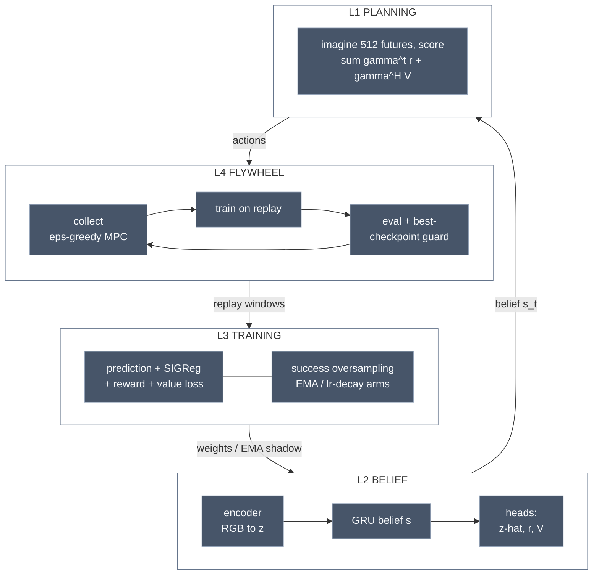

# Our Agent: the Four Optimization Layers

## What it is

The system we actually built (exps 0001–0010), as nested optimization loops — each
layer optimizes something different, on a different timescale, with a different
algorithm:

Full per-layer specifics (loss weights, planner params, ignition rules) are in the
table below and the module docstrings.

## Which algorithm optimizes what

| Layer | Optimizer | Objective | Timescale | Known failure (exp) |
|---|---|---|---|---|
| L1 planning | CEM (sampling) | discounted imagined return | per action | horizon blindness → value head (0005→0006); argmax oscillation (0004) |
| L2 belief/model | — (forward pass) | state estimation | per step | obs-scale mismatch (0006); collapse w/o SIGReg (0001) |
| L3 training | Adam on joint loss | model+heads fit | per update | **catastrophic interference (0009/0010, open)**; reward starvation (0004); compounding rollout error (0004) |
| L4 flywheel | greedy data loop | data quality | per round | ignition (0008→0009, solved); instability amplification (0005) |

## Why it matters here

Every experiment so far has been a failure at exactly one layer, fixed by a
mechanism at that layer. When something breaks, locate the layer first — the table
doubles as a diagnosis guide. Contrast with the published systems: Dreamer replaces
L1 with a learned actor (amortized planning — our likely path for Crafter speed);
TD-MPC2 keeps L1 but learns value by TD instead of MC; PPO has no L2/L4 and fuses
L1 into the policy.

## Links

[[jepa]] · [[latent-collapse]] · [[imagination-training]] · [[value-equivalent-planning]] ·
experiments 0001–0010 · `src/world_model/` (modules link back here)
