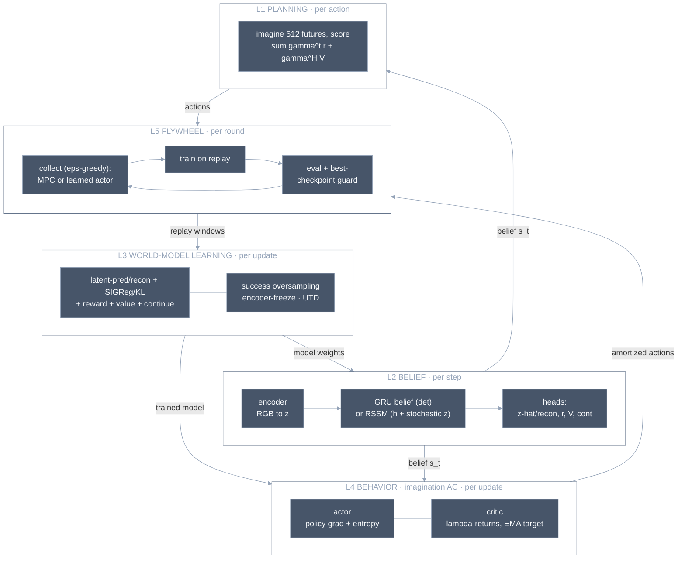

# Our Agent: Nested Optimization Layers

## What it is

The system we actually built (exps 0001–0019), as nested optimization loops — each
layer optimizes something different, on a different timescale, with a different
algorithm. **Currently five layers** — it was four through exp 0015; the imagination
actor-critic (exps 0017–0019) added L4, the learned-behavior loop. The count tracks
the architecture, not the reverse — add a layer when a genuinely new optimization
process appears:

Full per-layer specifics (loss weights, planner params, ignition rules) are in the
table below and the module docstrings.

## Which algorithm optimizes what

| Layer | Optimizer | Objective | Timescale | Known failure (exp) |
|---|---|---|---|---|
| L1 planning | CEM (sampling) | discounted imagined return | per action | horizon blindness → value head (0005→0006); argmax oscillation (0004) |
| L2 belief/model | — (forward pass); GRU det. **or** RSSM stochastic | state estimation + dynamics | per step | obs-scale mismatch (0006); collapse w/o SIGReg (0001); deterministic-model exploitation → RSSM stochastic latents (0017→0019) |
| L3 world-model learning | Adam on model+heads loss | fit dynamics + reward + value + continue (latent-pred/recon, SIGReg/KL) | per update | **catastrophic interference (0009/0010 → localized to encoder drift, stopped by encoder-freeze @r2, 0013; stability↔perf frontier 0014/0015)**; reward starvation (0004); compounding rollout error (0004) |
| L4 behavior (imagination AC) | policy gradient (actor) + λ-return regression (critic, EMA target) | maximize imagined return | per update | model exploitation / inflated imagined return (0017); no termination → continue predictor (0018); deterministic compounding error over the 25-step chain → stochastic latents (0019) |
| L5 flywheel | greedy data loop | data quality | per round | ignition (0008→0009, solved); instability amplification (0005) |

## Why it matters here

Every experiment so far has been a failure at exactly one layer, fixed by a
mechanism at that layer. When something breaks, locate the layer first — the table
doubles as a diagnosis guide.

**Two acting modes now coexist.** L1 plans by search (zero-shot, slow per action);
L4's learned actor is *amortized* planning (one forward pass, the Crafter-speed path —
Dreamer's choice, now ours). They share the same model (L2) and the same data loop
(L5). The actor is **not** distilled from the planner (exp 0016's BC route failed on
compounding error) — it is trained on-policy in imagination (L4). L4 is also where
model exploitation lives: optimizing a learned model rewards its inaccuracies, which
is why the continue predictor (0018) and stochastic latents (0019 — built, running on
the updated code, not yet validated) are L4-enabling fixes, not L3 ones.

Contrast with published systems: **Dreamer** is L2(RSSM)+L3+L4+L5 with no L1 — pure
amortized behavior; **TD-MPC2** keeps L1 but learns its value by TD; **PPO** is
model-free — no L1/L2/L3, just L4's behavior objective trained on *real* returns
instead of imagined ones, folded into one data loop.

## Links

[[jepa]] · [[latent-collapse]] · [[imagination-training]] · [[dreamerv3-2023]] ·
[[value-equivalent-planning]] · [[generative-vs-predictive]] (why optimizing a learned
model hallucinates) · [[0017-imagination-actor-critic]] · [[0018-continue-predictor]] ·
[[0019-stochastic-latents]] · experiments 0001–0019 · `src/world_model/` (modules link
back here)
