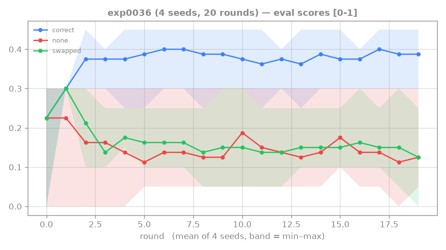
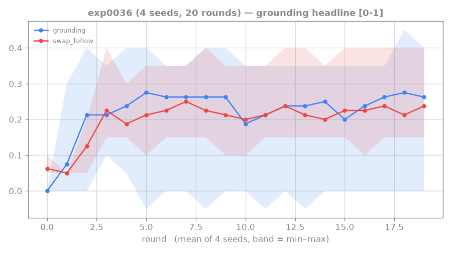
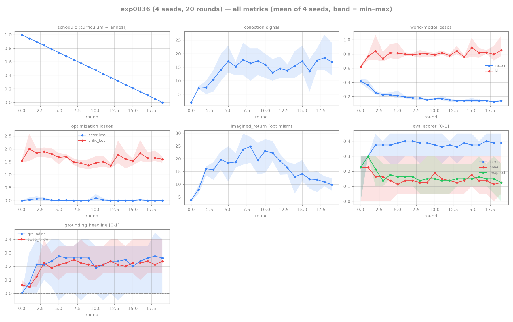

# 0036: reading-shaping IGNITES genuine (partial) reading-to-learn-dynamics

## Hypothesis

exp0035 showed one_shot length-1 is too sparse to ignite reading from scratch (0–6 chance
events/round, no gradient). crafter-rtfm's HO-0007 fix: `CrafterRTFMEnv(reading_shaping_coef=c)` —
a **dense per-step reward** for advancing the **displayed** manual's gesture, while the achievement
stays strictly one_shot (search can't farm it). Wired into the trainer as `r_read = tutorial-only +
info["reading_shaping"]`, with `c` **linearly annealed 1.0 → 0** over 20 rounds and **eval always at
c=0** (shaping off). Predict: the dense reading-gated gradient ignites reading where the sparse
honest reward could not — and because the gradient is climbable *only* by reading (the displayed
gesture is text-carried, ⊥ vision/world per crafter-rtfm exp 0006), ignition should be **genuine**
(swapped≪correct, swap_follow rises), not the LRS-brittleness shortcut. 4 seeds, length-1, held-out
eval splits.

## Result — ignition YES; genuine reading on 3/4 seeds; grounding partial

Final round (round 19, **coef=0.000** — shaping fully removed, the honest regime):

| seed | correct | none | swapped | grounding (c−n) | swap_follow |
|---|---|---|---|---|---|
| s1 | 0.45 | 0.05 | **0.00** | 0.40 | 0.25 |
| s2 | 0.40 | 0.05 | **0.10** | 0.35 | **0.40** |
| s3 | 0.40 | 0.10 | **0.15** | 0.30 | 0.15 |
| s0 | 0.30 | 0.30 | 0.25 | 0.00 | 0.15 |

- **Ignition: YES.** Tutorial events climbed from exp0035's 0–6 chance floor to **12–27/round**, and
  *held there at coef=0* (rounds 18–19) — the reading skill **persists after the shaping
  training-wheels are removed**, so the agent isn't merely chasing the shaping signal.
- **Genuine content-reading: YES on 3/4 seeds.** `correct ≫ none` (reading is used) AND
  **`swapped ≪ correct`** (s1 0.00, s2 0.10, s3 0.15 vs correct ~0.4): a swapped manual *misleads*
  the agent — it stops doing the true recipe when shown the wrong manual. This is exactly the signal
  [[0033-rtfm-length1-grounding]] FAILED (there swapped≈correct, swap_follow=0 = baking/vision
  shortcut). **The shortcut the lit-gate warned of (LRS-brittleness, arxiv:2305.16621) did not
  fire** — a shortcut would show swapped≈correct.
- **Grounding is PARTIAL, not strong.** `swap_follow` is only 0.15–0.40: the agent reads enough to
  be *disrupted* by a wrong manual (swapped≪correct) but does not reliably *execute* the swapped
  gesture (swap_follow well below the scripted reader's 1.0). And **s0 failed entirely**
  (none=correct=swapped, grounding 0) — one seed never grounded.

## Trajectory

### eval scores by manual mode

_`correct` rises well above `none` and `swapped` over training and the `swapped` band stays low —
the content-sensitivity signal (a wrong manual misleads the agent). The wide min–max band is the
3/4-vs-1/4 seed split: three seeds ignite genuine reading while s0 never grounds, so its
`correct≈none≈swapped` pins the band's low edge._

### grounding headline

_`grounding` (correct−none) lifts off zero, but `swap_follow` only reaches ~0.15–0.40 — partial
execution: the agent is *disrupted* by a wrong manual yet does not reliably *execute* the displayed
gesture (well below a scripted reader's 1.0). This is the "reads but under-executes" frontier the
Lesson names._

## Lesson

**First genuine reading-to-learn-dynamics result on this stack: ignited from scratch, content-
sensitive, no shortcut.** The dense reading-gated shaping (HO-0007) broke the exp0035 ignition
deadlock, and the anneal-to-0 + held-out swap eval confirmed the reading is real, not training-wheel
dependent and not a non-reading shortcut. This validates the HO-0007 env mechanism → **accept**.

**The frontier moves from "does it read?" to "how strongly?"** The WM reads (swapped≪correct proves
the belief is content-sensitive), but the actor under-*executes* the read content (low swap_follow).
Diagnosis: the agent partially relies on the displayed manual (hence disrupted by a wrong one) but
hasn't committed to "execute the displayed gesture" as a robust policy — likely because collection
is always CORRECT mode, where "follow displayed" and "do the true recipe" are indistinguishable.

**Lit-gate context (cite in any write-up):** RTFM (arxiv:1910.08210) and Messenger (2101.07393) both
needed *curriculum*, not shaping, to ignite — our shaping-as-ignition is novel for this lineage.
Dynalang (2308.01399), the architecturally-matched DreamerV3+language baseline, ignited via an
**auxiliary text-prediction loss** instead — the candidate for strengthening swap_follow next
([[dynalang-2023]], incl. the static-manual copy-through caveat + masked-reconstruction fix).

→ next forks (to strengthen swap_follow toward the scripted-reader's 1.0, re-verifying swapped≪correct
each time): (1) **more training / slower anneal** — cheap test of whether it's just undertrained
(swap_follow was still rising late on some seeds); (2) **Dynalang-style masked-manual auxiliary**
(lit-backed, sharpens the WM's reading); (3) **actor-conditioning** (direct text→action path, the
design §6.2 open question — but re-check baking via swapped≪correct on held-out).

## Reproduction

- Commit: (this milestone) @world-model; env `809d44f@crafter-rtfm` (`reading_shaping_coef`).
- `scripts/dispatch_rtfm.sh exp0036 4 --rounds 20 --episodes-per-round 60 --updates-per-round 400
  --ac-updates-per-round 400 --seq-batch 16 --window 12 --burn-in 4 --horizon 10 --n-train-seeds 400
  --n-eval-seeds 20 --max-steps 48 --length 1 --one-shot --reading-shaping-coef 1.0`
- Artifacts: `runs/exp0036/` (4 seeds + logs).

## Links

[[0034-rtfm-oneshot-ignition]] · [[0033-rtfm-length1-grounding]] · [[rung4-manual-conditioned-agent]] · [[dynalang-2023]] · [[language-grounding]] · [[no-hardcoded-env]]

## All-metrics overview

