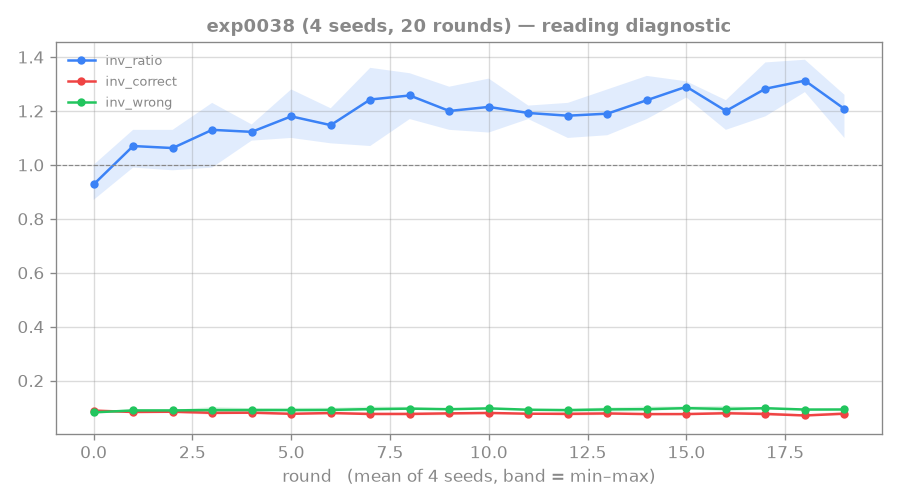
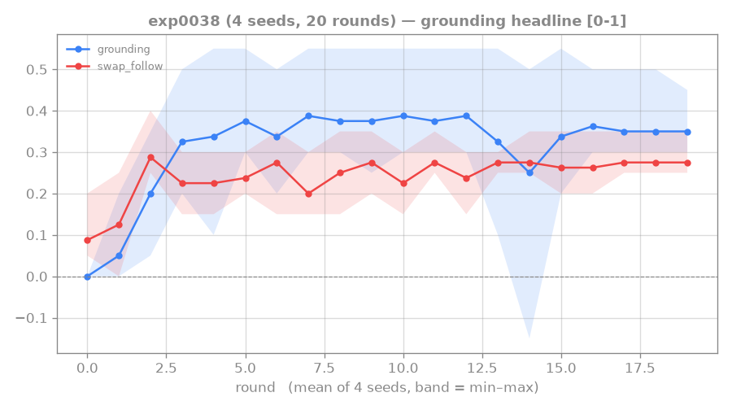
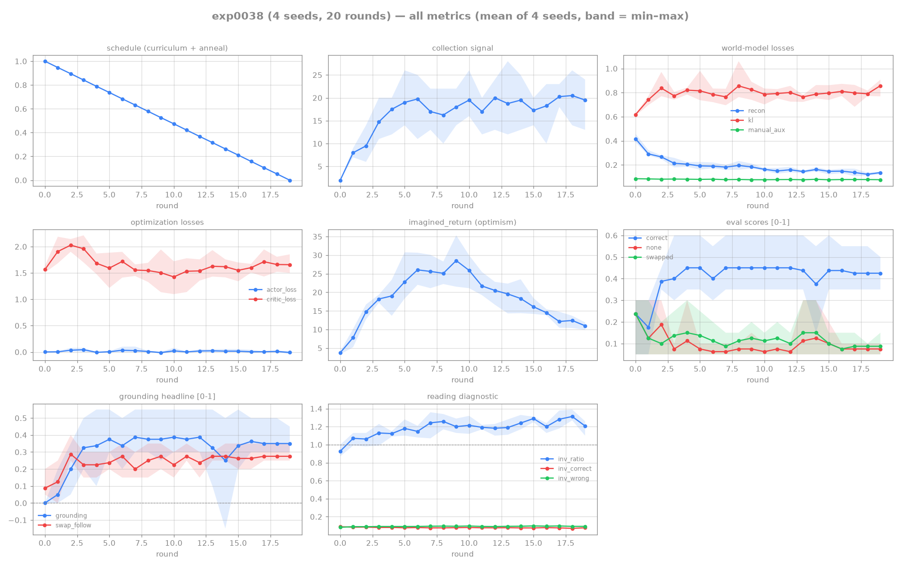

# 0038: the masked-manual aux grounds the WM — but swap_follow is ACTOR-bound, not WM-bound

## Hypothesis

exp0036 ignited genuine but *partial* reading (swapped≪correct, but swap_follow only 0.15–0.40).
Two strengthening levers, tested in order:
- **exp0037 (control): is it undertraining?** Re-ran exp0036 at **2× rounds (40)**. Predict: if more
  training closes the gap, swap_follow climbs.
- **exp0038: the Dynalang-style masked-manual auxiliary** ([[dynalang-2023]] option A, commit
  0b72bcd) — a dense self-supervised reading gradient. Same config as exp0036 + `--manual-aux-coef
  1.0`. Predict: a stronger WM reading signal lifts swap_follow; the `inv_ratio` diagnostic
  (wrong/correct manual reconstruction loss) tells us if the aux is genuine (≫1) or trivial (≈1).

## Result

**exp0037 (2× training): NULL.** swap_follow unchanged — mean ~0.25, same 0.15–0.40 seed scatter
(s1 0.25→0.40 but s2 0.40→0.25; no systematic gain). More training is **not** the lever; shaping
alone plateaus reading regardless of length.

**exp0038 (aux on): the aux grounds the WM, improves robustness, but does NOT lift swap_follow.**
Final round (round 19, coef=0, aux on):

| seed | correct | none | swapped | swap_follow | inv_ratio |
|---|---|---|---|---|---|
| s0 | 0.40 | 0.10 | 0.15 | 0.35 | 1.26 |
| s1 | 0.50 | 0.05 | 0.05 | 0.25 | 1.10 |
| s2 | 0.35 | 0.05 | 0.05 | 0.25 | 1.23 |
| s3 | 0.45 | 0.10 | 0.10 | 0.25 | 1.24 |

- **The aux is a genuine grounding signal.** `inv_ratio` rose from the 0.87 untrained baseline to
  **1.1–1.4** — the belief reconstructs *this* episode's manual better than a wrong one, so it is
  manual-specific. **NOT the copy-through failure** (which would pin inv_ratio≈1); the `deter_noctx`
  anti-baking belief held.
- **Robustness improved.** All 4 seeds now ground (s0, which *failed* in exp0036 with grounding 0.00,
  recovers to 0.30); swapped≪correct is clean on every seed (0.05–0.15 vs correct 0.35–0.50).
- **swap_follow did NOT break its ceiling** (~0.25–0.35, ≈ exp0036). Strengthening the WM's reading
  (which the aux demonstrably did, per inv_ratio) does not move the execution metric.

## Trajectory

### reading diagnostic (the aux works)

_`inv_ratio` climbs above the dashed 1.0 line to ~1.1–1.4 — feeding a shuffled manual measurably
worsens the auxiliary reconstruction, so the belief is manual-specific (genuine reading, not the
copy-through failure that would pin it at 1.0). The aux did its job on the WM._

### grounding headline (but execution doesn't move)

_Despite the rising `inv_ratio`, `swap_follow` stays flat at ~0.25 — strengthening the WM's reading
does not move the execution metric. Side-by-side, these two panels are the whole result: reading ↑,
execution flat ⇒ the bottleneck is the actor, not the world model._

## Lesson

**The swap_follow bottleneck is the ACTOR's execution, not the WM's reading.** Two independent
levers that strengthen *reading* — more training (0037) and a validated reading auxiliary that
provably raised inv_ratio (0038) — both left swap_follow at ~0.25. The WM reads the manual (inv_ratio
>1, swapped≪correct, all seeds ground); the agent does not reliably *perform* the displayed
manual's gesture.

**The likely root cause — an identifiability gap in correct-mode training.** Collection is always
`ManualMode.CORRECT`, where "follow the displayed manual" and "do the episode's true recipe" are the
**same policy** — the reward gradient cannot distinguish them. swap_follow (on a *swapped* manual)
is exactly the probe that separates them, but nothing in training pressures the agent toward the
displayed-following branch. So the agent reads enough to be *disrupted* by a wrong manual (swapped
low) but lands between "follow displayed" and "ignore," not committed to execution.

**This is a positive result for the aux** (it grounds the WM and fixes the worst seed) and a sharp
**re-diagnosis** of the remaining gap: swap_follow is bounded by the actor / the training
distribution, not by WM reading strength. Per the [[no-hardcoded-env]] / anti-baking discipline,
swap_follow stays the gold-standard metric — we just now know which component limits it.

**Stall-rule note:** swap_follow has now resisted 2 strengthening levers (0037, 0038). But 0038
produced a *new* diagnosis (actor-bound, not WM-bound), so the next redesign targets a different
component — not a stalled repeat. Candidate next steps, in cost order: (1) **stronger aux coef** —
cheap disambiguator: does a higher inv_ratio move swap_follow at all? (exp0039); (2) **actor-
conditioning** (design §6.2) — give the actor direct access to M (targets the execution bottleneck;
re-verify swapped≪correct on held-out for baking); (3) if both fail, swap_follow ~0.25 may be a
fundamental limit of correct-mode reward training → a training-distribution change or a
research-direction call (park with this writeup).

## Reproduction

- Aux infra commit 0b72bcd@world-model (`--manual-aux-coef`, default 0 = off; `manual_aux.py`).
- exp0037: `dispatch_rtfm.sh exp0037 4 ... --rounds 40 ... --reading-shaping-coef 1.0`
- exp0038: `dispatch_rtfm.sh exp0038 4 ... --rounds 20 ... --reading-shaping-coef 1.0 --manual-aux-coef 1.0`
- Artifacts: `runs/exp0037/`, `runs/exp0038/` (4 seeds + logs; inv_ratio in each round line).

## Links

[[0036-rtfm-shaping-ignition]] · [[dynalang-2023]] · [[rung4-manual-conditioned-agent]] · [[hierarchy-and-credit]] · [[no-hardcoded-env]]

## All-metrics overview

