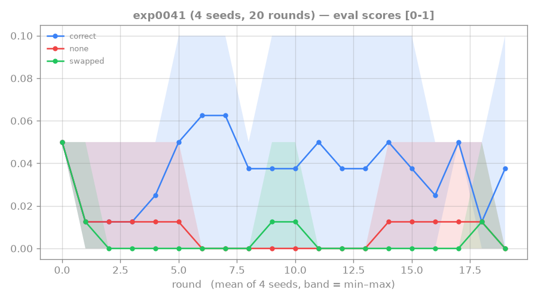
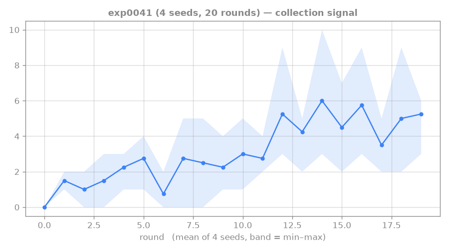
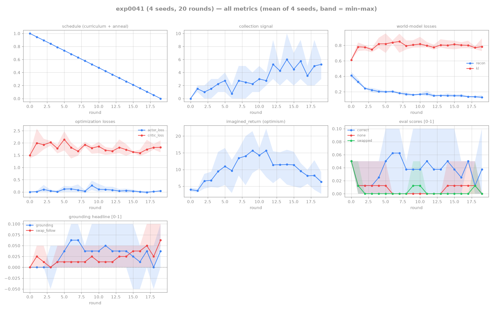

# 0041: the length-1 ignition recipe does NOT generalize to length-2

## Hypothesis

exp0036 ignited genuine reading at **length-1** (single-action gesture). Natural ladder step: does
the *same* validated recipe (HO-0007 shaping anneal 1.0→0, one_shot, no aux/actor-cond) ground at
**length-2** (a two-action gesture)? Same config as exp0036 with `--length 2`, 4 seeds, held-out eval.

## Result — no ignition at length-2

Final round (coef=0):

| seed | correct | none | swapped | grounding | swap_follow | tutorial events/round |
|---|---|---|---|---|---|---|
| s0 | 0.10 | 0.00 | 0.00 | 0.10 | 0.05 | ~6 |
| s1 | 0.00 | 0.00 | 0.00 | 0.00 | 0.10 | ~6 |
| s2 | 0.05 | 0.00 | 0.00 | 0.05 | 0.05 | ~3 |
| s3 | 0.00 | 0.00 | 0.00 | 0.00 | 0.05 | ~6 |

Tutorial events stay at **3–6/round** (vs length-1's 12–27 with the same shaping), and correct never
lifts off ~0. The recipe that ignited length-1 **does not ignite length-2**.

## Trajectory

### eval scores (no ignition)

_`correct` never lifts off ~0 across all rounds and seeds — the flat trajectory *is* the result.
The same shaping recipe that ignited length-1 produces no learning signal at length-2._

### collection signal (the cause)

_Tutorial events stay pinned at ~3–6/round (vs length-1's 12–27 under identical shaping). A
single-attempt two-action gesture (~17² space) is too sparse for the one_shot achievement to fire
from scratch, so there is nothing for `correct` to learn from — the ignition failure is an
exploration/sparsity wall, not a reading wall._

## Lesson

**Length-1 is the current ceiling of the rung-4 recipe.** Length-2 is combinatorially much harder:
the agent must read a *two-action sequence* AND execute it correctly on the **single** one_shot
attempt (~17² gesture space). The dense reading-shaping advances the agent through the displayed
gesture, but a single-attempt 2-step sequence is too sparse for the achievement to ignite from
scratch — events stay near chance, so there is no learning signal for `correct`.

**This is the lit-backed curriculum case, and it's where the literature said we'd land.** The
rung-4 lit-gate (this session) found that **RTFM and Messenger BOTH required curriculum complexity
staging** to ignite reading at higher coreference/recipe complexity — sparse reward alone never did
it, and reward *shaping* of the kind we used has no precedent as the primary ignition mechanism at
their harder settings. exp0041 is the empirical confirmation: shaping ignites length-1 but stalls at
length-2. The principled next step is a **length curriculum** (length-1 → length-2, the agent
carries the length-1 reading skill into the harder setting) — but that is a new design direction
worth human sign-off, not another autonomous lever.

→ next (open call): a length-1→length-2 curriculum (lit-backed: RTFM/Messenger), or treat
length-1 as the demonstrated rung-4 result and consolidate before scaling.

## Reproduction

- Commit 12b66f6@world-model (validated exp0036 recipe; `--length 2`).
- `dispatch_rtfm.sh exp0041 4 --rounds 20 ... --length 2 --one-shot --reading-shaping-coef 1.0`
- Artifacts: `runs/exp0041/` (4 seeds + logs).

## Links

[[0036-rtfm-shaping-ignition]] · [[0040-rtfm-actor-conditioning]] · [[rung4-manual-conditioned-agent]] · [[no-hardcoded-env]]

## All-metrics overview

