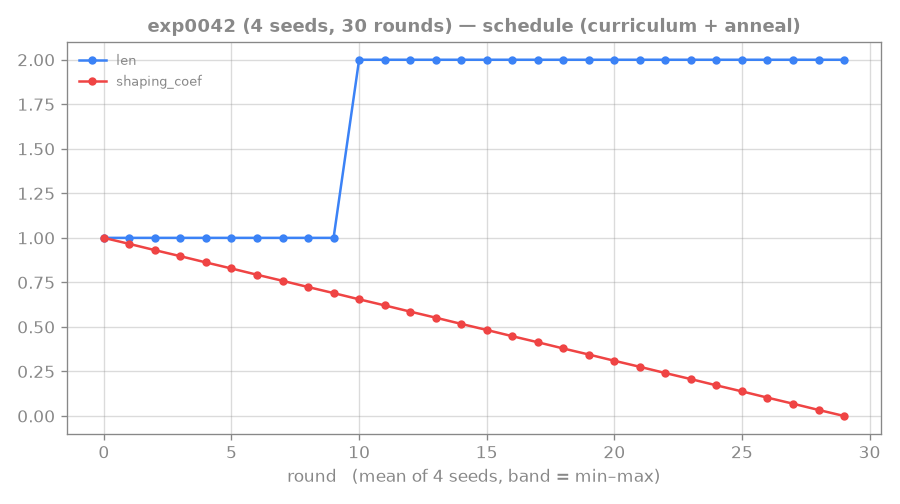
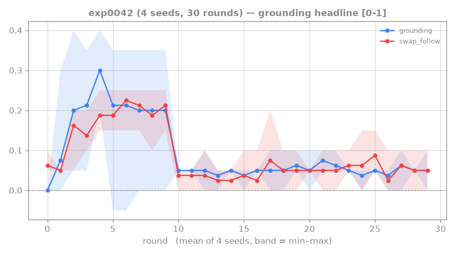
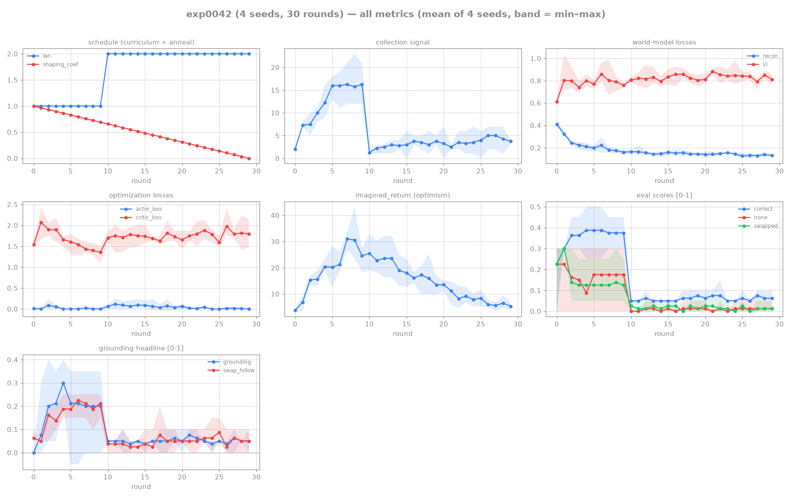

# 0042: length curriculum does NOT crack length-2 — the wall is multi-step EXECUTION

## Hypothesis

exp0041: the length-1 recipe doesn't cold-start at length-2. Lit-backed fix (RTFM/Messenger
curriculum staging + Dreamer-4's "deep tree needs staging"): warm up at length-1 (where reading
ignites, exp 0036), then switch to length-2 so the agent carries the reading skill in.
`--curriculum-rounds 10` (length-1) then 20 rounds at `--length 2`, shaping annealing across all 30,
4 seeds. Predict: the warm-started reading skill transfers and length-2 grounds.

## Result — warm-up ignites length-1, then length-2 collapses and never recovers

| phase | seed | correct | none | swapped | grounding | swap_follow |
|---|---|---|---|---|---|---|
| **len-1 end (r9)** | s2 | 0.35 | 0.00 | 0.05 | **0.35** | 0.25 |
| | s3 | 0.45 | 0.10 | 0.15 | **0.35** | 0.25 |
| | s0/s1 | 0.30/0.40 | 0.30/0.30 | — | 0.00/0.10 | — |
| **len-2 end (r29)** | s0 | 0.05 | 0.00 | 0.00 | 0.05 | 0.05 |
| | s1 | 0.05 | 0.00 | 0.05 | 0.05 | 0.00 |
| | s2 | 0.10 | 0.00 | 0.00 | 0.10 | 0.10 |
| | s3 | 0.05 | 0.05 | 0.00 | 0.00 | 0.05 |

The length-1 warm-up **worked** (2/4 seeds ground, swapped≪correct — replicates exp 0036). But at the
switch to length-2, `correct` drops 0.35 → 0.05 and **stays there for all 20 length-2 rounds**. The
warm-started reading skill does NOT transfer to 2-step gestures; the curriculum is no better than the
exp-0041 cold-start.

## Trajectory

### schedule (the curriculum switch)

_`len` steps 1→2 at round 10 (the `--curriculum-rounds 10` warm-up boundary); read the eval panels
against this jump._

### grounding headline (ignites, then collapses at the switch)

_During the length-1 warm-up `grounding` ignites (2/4 seeds, band's upper half reaching ~0.35,
replicating exp0036). At the round-10 switch to length-2 it collapses to ~0.05 and **stays flat for
all 20 length-2 rounds** — the warm-started reading skill does not transfer to 2-step gestures. The
curriculum is no better than the exp-0041 cold-start._

## Lesson — reading is solved; the wall is multi-step EXECUTION

This is the **second failed lever on length-2** (cold-start 0041, curriculum 0042), and it converges
with the parked swap_follow result (0037–0040) into one coherent diagnosis:

- **The WM reads** — length-1 grounds robustly (correct≫none, swapped≪correct, inv_ratio>1 in 0038).
- **The actor under-executes** — swap_follow stuck ~0.25 even at length-1 (0040, actor-bound); and a
  2-step gesture (length-2) won't ignite at all, cold OR warm-started.

So the bottleneck across three independent angles is **multi-step / compositional EXECUTION of read
content**, not reading. A length-2 gesture is the simplest compositional case, and it's exactly where
the read→imagine→execute pipeline breaks — which matters because the Crafter deep tree (ADR-0007) is
*all* multi-step execution. Cracking (or understanding) length-2 is therefore on the critical path,
not toy-polishing.

**Open question this raises — reading-compositionality vs execution.** exp0042 had the aux OFF, so we
have no `inv_ratio` at length-2: we cannot yet tell whether the WM even *reads* the 2-step gesture
(belief manual-specific at length-2?) or reads it but the actor can't *execute* it. exp 0043 runs the
length-2 curriculum **with the aux on** to localize the wall: inv_ratio>1 + correct≈0 ⇒ pure
execution failure; inv_ratio≈1 ⇒ the WM doesn't compose the 2-step reading either.

→ next: exp 0043 (localizing diagnostic). Then the fix targets EXECUTION — the milestone's later
pillars (goal-conditioning, hierarchy/[[hierarchy-and-credit]]) — which are bigger architectural
bets to weigh (and echo Dreamer-4's per-subtask conditioning for the deep tree).

## Reproduction

- Commit 991ed32@world-model (`--curriculum-rounds`).
- `dispatch_rtfm.sh exp0042 4 --rounds 30 --curriculum-rounds 10 ... --length 2 --one-shot --reading-shaping-coef 1.0`
- Artifacts: `runs/exp0042/` (4 seeds + logs; round line shows `len=1`/`len=2`).

## Links

[[0041-rtfm-length2-generalization]] · [[0040-rtfm-actor-conditioning]] · [[0036-rtfm-shaping-ignition]] · [[hierarchy-and-credit]] · [[0007-crafter-mastery-milestone]] · [[dreamer4-2025]]

## All-metrics overview

