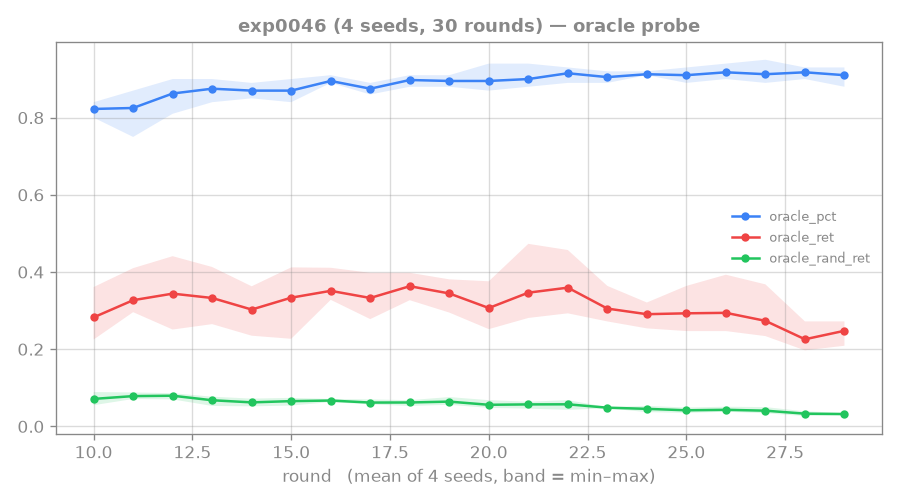
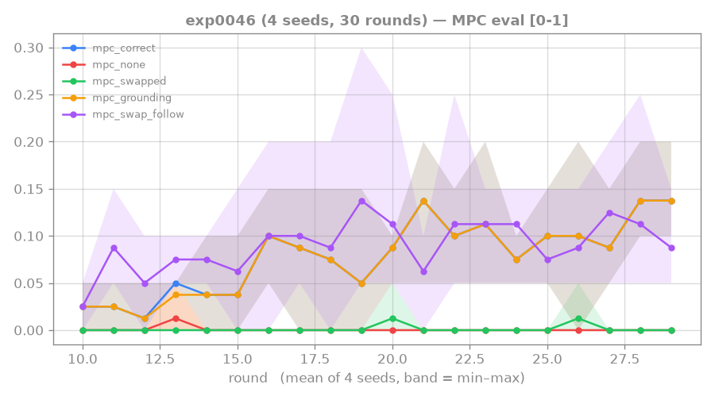
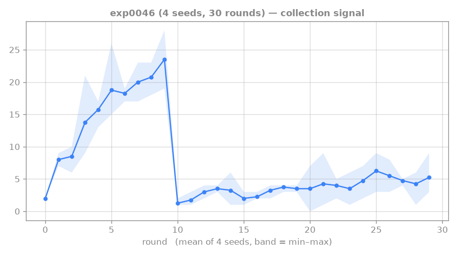
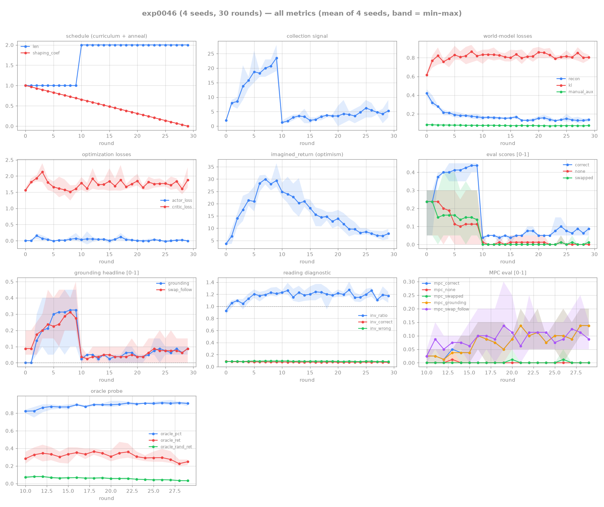

# 0046: robust-planning lever — sampled-rollout MPC partly shaves the reward head's OOD false positives

## Hypothesis

exp0045 localized the length-2 execution wall: the manual-conditioned WM reads AND values the true
gesture (oracle percentile ≈ 0.88, return 5–6× random) — but it is NOT the argmax, because the reward
head OVERRATES ~12% of out-of-distribution action sequences, and naive MPC (which maximizes predicted
reward over a **prior-mean** rollout) chases those false positives. The prior-mean rollout is a single
OPTIMISTIC point estimate per candidate, so OOD sequences whose mean is overrated win.

**v1 (sampled-rollout MPC).** Replace the prior-mean rollout in `agents/rtfm_mpc.py::_rollout_returns`
with **K=10 sampled rollouts** (z ~ prior `.rsample()`) per candidate, scored by the **mean** return
across samples. Averaging penalizes optimistic OOD point-estimates (high-variance/unreliable
predictions regress toward the random baseline), so the true gesture — which the WM values
*consistently* — should rise toward the argmax. Predict: **oracle pct → ~1.0 AND MPC `correct` lifts
off the ~0.05 floor**, while `swapped ≪ correct` holds on held-out (anti-baking preserved).

## Setup

- **Code:** commit 7901aaa@world-model — `_rollout_returns` gains `n_rollout_samples` (K); K=1 keeps
  the exact deterministic prior-mean estimator, K>1 rolls each candidate K times (`.rsample`) and
  scores by mean return. Threaded through `plan_action`, `RTFMMPCAgent`, the oracle probe, and the
  `--mpc-rollout-samples` CLI flag. CPU tests in `tests/test_rtfm_mpc.py` (shape, K=1==prior-mean,
  plan_action with K>1).
- **Dispatch** (curriculum+aux WM, as exp0044/0045; 4 seeds, ~1h45m local):
  `scripts/dispatch_rtfm.sh exp0046 4 --rounds 30 --curriculum-rounds 10 --episodes-per-round 60
  --updates-per-round 400 --ac-updates-per-round 400 --seq-batch 16 --window 12 --burn-in 4
  --horizon 10 --n-train-seeds 400 --n-eval-seeds 20 --max-steps 48 --length 2 --one-shot
  --reading-shaping-coef 1.0 --manual-aux-coef 1.0 --mpc-eval --oracle-probe --mpc-rollout-samples 10`
- **Artifacts:** `runs/exp0046/s{0..3}.log` + `s{0..3}_s{0..3}.pt`.

## Result — partial: oracle pct 0.88 → ~0.92, MPC correct 0.05 → ~0.11, anti-baking intact

Averaged over the last 5 length-2 rounds (rounds 25–29), 4 seeds. exp0045 baselines: oracle pct
≈ 0.88, MPC/reactive `correct` ≈ 0.05.

| seed | oracle pct | MPC correct | MPC swapped | MPC swap_follow | reactive correct | inv_ratio |
|---|---|---|---|---|---|---|
| s0 | 0.918 | 0.130 | 0.000 | 0.150 | 0.090 | 1.18 |
| s1 | 0.900 | 0.050 | 0.000 | 0.050 | 0.060 | 1.17 |
| s2 | 0.934 | 0.160 | 0.000 | 0.120 | 0.080 | 1.20 |
| s3 | 0.908 | 0.090 | 0.010 | 0.060 | 0.070 | 1.21 |
| **avg** | **0.915** | **0.108** | **0.003** | **0.095** | **0.075** | **1.19** |

- **oracle pct: 0.88 → 0.915** (all 4 seeds > 0.90, tight band) — a small, consistent lift, but it
  **plateaus ~0.91, not ~1.0**.
- **MPC correct: 0.05 → 0.108** (≈2× the reactive floor 0.075 and the exp0045 MPC floor ~0.05), but
  seed-dependent (s1 stays at floor; s0/s2 reach 0.13–0.16) and noisy at n=20.
- **MPC swapped ≈ 0.003** with correct ≈ 0.108 → `swapped ≪ correct` holds cleanly (anti-baking
  preserved; the lift is grounding, not memorization).
- **inv_ratio 1.19 > 1** — the WM is still genuinely reading (not a trivial copy-through).

## Trajectory

### oracle probe — the lever moved the headline, but only partway

`oracle_pct` (blue) rises from ~0.82 at the length-2 onset (round 10) to a ~0.91 plateau by round ~22
and holds it through round 29, with a tight min–max band — so the K=10 averaging *does* consistently
shave some reward-head OOD false positives, exactly the predicted direction. But it **plateaus short
of 1.0**: averaging removes the easy-to-regress optimism, not the bulk of the ~12% overestimation. The
oracle/random *ratio* even widens because `oracle_rand_ret` (green) drifts down (0.07 → 0.03) while
`oracle_ret` (red) holds ~0.3 — the gesture stays well-valued; the wall is the residual high-ranked
junk, not loss of signal.

### MPC eval — correct edges off the floor, swapped pinned at zero

`mpc_correct`/`mpc_grounding` (none ≈ 0, so they coincide) climb to ~0.10 in the back half — ~2× the
reactive floor — while `mpc_swapped` (green) sits flat at **zero** the entire phase. That is the
load-bearing read: the modest gain is genuine reading-conditioned execution, not baking. But the bands
are wide (one seed never leaves the floor), so this is a faint, under-powered lift — consistent with
the oracle pct only reaching ~0.91: the planner finds the gesture more often, not reliably.

### collection signal — why the reward head stays OOD-miscalibrated

Tutorial achievements earned during data collection climb to ~24/60 over the length-1 curriculum,
then **crash to ~1–2/60 at the round-10 length-2 switch** and only recover to ~5/60 by round 29. The
reward head is trained on a trickle of positive length-2 examples (~8%), so it never gets the data to
sharpen its OOD calibration — the upstream cause of the ~12% false-positive rate this experiment is
fighting at the planning layer. Robust *planning* alone can't fully fix a head that is starved at
*training* time; it can only discount the optimism it already shows.

## Lesson

**Sampled-rollout averaging is a real but partial lever — directionally validated, under-powered.** It
moved both the oracle pct (0.88 → 0.92) and MPC `correct` (0.05 → ~0.11) the predicted way with
anti-baking cleanly preserved (`swapped` ≈ 0), confirming that *some* of the reward head's OOD
overestimation is prior-mean optimism that averaging regresses away. But the oracle pct plateaus at
~0.91, not ~1.0: the **bulk of the ~12% false-positive mass is not mere rollout optimism** — it is a
genuinely miscalibrated reward head, and the collection-signal panel shows why (length-2 positives are
starved, ~5/60). This matches the pre-registered counter-outcome: v1 helps but does not clear the
standing bar, so escalate by composing it with the calibration levers rather than tuning K further.

→ next (compose, don't replace):
1. **Pessimism** — penalize each step's predicted reward by the reward head's two-hot distributional
   spread (uncertainty), so high-variance OOD predictions are discounted, not just averaged.
2. **Continue-head gating** — multiply predicted reward by predicted continue prob to down-weight
   off-distribution/terminal states the rollout drifts into.
3. **Reward-head OOD regularization at WM-train time** — the root fix the collection-signal panel
   points to: the head is starved of length-2 positives, so add in-distribution regularization /
   penalize actions the WM is uncertain about during training so the gesture becomes ~argmax.

The oracle probe remains the readout for each: a variant works iff it raises oracle pct toward 1.

## Links

[[0045-rtfm-oracle-probe]] · [[0044-rtfm-mpc-execution]] · [[hierarchical-imagination-agent]] · [[imagination-training]] · [[0021-critic-on-replay]] · [[0007-crafter-mastery-milestone]]

## All-metrics overview

</content>
</invoke>
