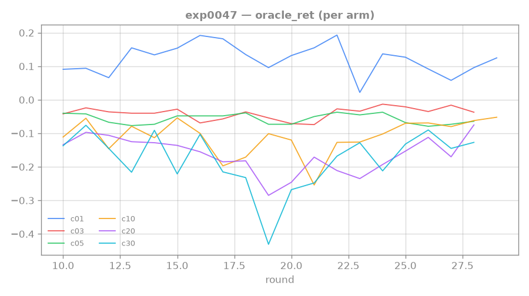
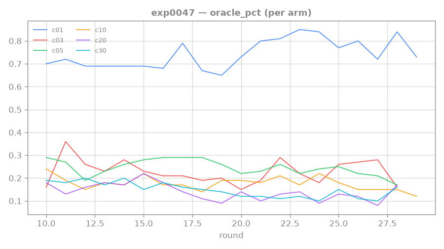

# 0047: conservative reward head — NEGATIVE; conservatism can't separate OOD junk from sparse true signal

**Status: PRE-REGISTERED + IMPLEMENTED (not yet harvested).** The capability build the wall-relocation
tripwire prescribes after exp0043/0044/0045/0046 localized the length-2 execution wall to reward-head
OOD calibration. Fresh-session pick-up: read [[0045-rtfm-oracle-probe]] + [[0046-rtfm-robust-planning]]
+ this page, then dispatch (code already on `master`).

## Hypothesis

exp0045 found the reward head ranks the true gesture only ~88th percentile (~12% of OOD action
sequences overrated above it); exp0046 found planning-time sampled-rollout averaging lifts that only to
~0.92 (partial) and concluded **calibration is a training-time prerequisite, not a planning-time
patch** — the head is *confidently wrong* on OOD actions because it is starved of length-2 positives
(collection-signal ~5/60). The literature maps this exactly as the offline-RL distributional-shift
problem at the reward layer ([[cql-2020]] / [[crop-2023]] / [[combo-2021]], scout 2026-06-15).

**Mechanism (CROP/CQL conservative reward head).** At WM-train time add a push-down term: per step,
sample M random (OOD) actions from the **detached** belief and penalise their predicted reward toward
zero (one-sided relu — only positive overestimates, suited to our sparse reward). The belief is
detached so the penalty shapes ONLY the reward head, not the representation. This is CROP's "minimise
prediction error AND predicted reward on random actions" (a deliberate online variant: our OOD set is
the current replay's complement, not a frozen dataset).

**Predict:** the reward head stops over-rating OOD sequences → **oracle pct (measured at K=1, the
exp0045 protocol) rises from ~0.88 toward ~1.0**, and **MPC `correct` lifts clearly off the ~0.05
floor**, with `swapped ≪ correct` on held-out (anti-baking preserved) and `oracle_ret` NOT collapsing
(over-suppression guard).

**Counter-outcomes (named).**
- *Null* (oracle pct unchanged ≈ 0.88, `reward_cons` term stayed ≈ 0): coef too weak → raise coef.
- *Over-suppression* (oracle pct rises but `oracle_ret` collapses toward `rand_ret`, MPC `correct`
  stays ≈ 0): the penalty crushed the TRUE gesture too → lower coef / make the push-down softer.
- *Calibrated-but-still-floored* (oracle pct → ~1.0 but MPC `correct` still ≈ 0.05): the wall is NOT
  (only) reward-head OOD calibration → relocate (continue-head gating, value tail, or genuine
  multi-step credit assignment / hierarchy). The oracle probe is the readout that disambiguates.

## Setup (implementation + dispatch)

- **Code (on `master`):** `train_rtfm.wm_train_rtfm` gains `reward_conservative_coef` (α) +
  `reward_conservative_samples` (M); CLI `--reward-conservative-coef` / `--reward-conservative-samples`
  (coef=0 = byte-for-byte unchanged). Per step:
  `cons += rew(belief.detach()[:,None,:].expand(b,M,·), randint(0,n_act,(b,M))).clamp_min(0).mean()`,
  added as `α·cons` to the WM loss; logged as `reward_cons`. CPU test
  `tests/test_rung4.py::test_conservative_reward_penalty_pushes_ood_reward_down` (optimising the term
  drives OOD predicted reward down).
- **Isolation choice:** run the oracle probe / MPC at **K=1** (`--mpc-rollout-samples` omitted) so the
  oracle pct is directly comparable to exp0045's 0.88 (K=1) and attributes any change to the
  conservative HEAD, not exp0046's rollout averaging. Composition with K=10 is the follow-up.
- **Coef is the unknown → two-phase sweep.** An initial single-config attempt at **coef=3.0**
  (4 seeds) showed *immediate, consistent over-suppression*: at the first length-2 eval (round 10) all
  4 seeds had oracle pct 0.13–0.24 (≪ the 0.88 baseline, below random) and **negative** oracle_ret
  (−0.05 to −0.15) — the penalty crushed the true gesture, not just the OOD false positives
  (no-penalty runs sat ~0.82 here). Redesigned per maintainer guidance: at the *exploration* stage,
  cover the coef axis (1 seed each) rather than replicate seeds; confirm the winner with a multi-seed
  control afterwards.
- **Phase 1 — exploration (6 coefs × 1 seed, all seed 0).** Fixing the seed makes it a *controlled*
  sweep: same init + data stream, so any difference is attributable purely to coef. Grid biased to the
  low end where the regime likely sits (3.0 known-bad, kept as the monotonicity anchor):
  α ∈ {0.1, 0.3, 0.5, 1.0, 2.0, 3.0} (6-wide local).
  `scripts/dispatch_rtfm.sh exp0047c{01,03,05,10,20,30} 1 --rounds 30 --curriculum-rounds 10
  --episodes-per-round 60 --updates-per-round 400 --ac-updates-per-round 400 --seq-batch 16
  --window 12 --burn-in 4 --horizon 10 --n-train-seeds 400 --n-eval-seeds 20 --max-steps 48
  --length 2 --one-shot --reading-shaping-coef 1.0 --manual-aux-coef 1.0 --mpc-eval --oracle-probe
  --reward-conservative-coef {0.1,0.3,0.5,1.0,2.0,3.0} --reward-conservative-samples 16`
  (dirs `runs/exp0047c01`…`c30`).
- **Phase 2 — control (auto, after phase 1).** The best coef (oracle pct ↑ + oracle_ret preserved +
  MPC correct off floor) gets a multi-seed (4-seed) confirmation run. 1-seed phase-1 results are
  treated as *candidates*, not conclusions (seed variance unquantified — flagged, not hidden).
- **Future — scaling (maintainer cost call).** If a coef shows promise and the trajectory suggests it
  may still be climbing at round 30, a *longer* run on a rented GPU (vast.ai) in parallel to other
  experiments is a candidate — PAID-RESOURCE flag: flag the cost, do not spend autonomously.

## Standing bar (success) — tag: `LADDER-EXIT`

Oracle pct (K=1) clearly above the exp0045 0.88 baseline and approaching ~1.0, AND MPC `correct`
clearly off the ~0.05 floor, with `swapped ≪ correct` on held-out and `oracle_ret` preserved. Clearing
this cracks the length-2 execution wall → unblocks the next rung (abstraction on a Crafter
state-chain). Stall note: exp0046's headline DID move (0.88→0.92), so this is not a stalled-thread
repeat; it is a genuinely new mechanism (training-time conservatism) with a literature anchor (CROP).

## Result — NEGATIVE: no coef helps; monotonic over-suppression

Phase-1 sweep, 6 coefs × 1 seed (all seed 0, controlled), final length-2 round (29). exp0045
baselines: oracle pct 0.88, mpc_correct 0.05 floor.

| coef α | reward_cons | oracle_pct | oracle_ret | rand_ret | mpc_correct | mpc_swap_follow |
|---|---|---|---|---|---|---|
| 0.1 | 0.01 | **0.73** | **+0.125** | +0.010 | 0.05 | 0.00 |
| 0.3 | ~0 | 0.16 | −0.037 | −0.008 | 0.00 | 0.05 |
| 0.5 | ~0 | 0.17 | −0.064 | −0.012 | 0.00 | 0.05 |
| 1.0 | ~0 | 0.12 | −0.052 | −0.011 | 0.00 | 0.00 |
| 2.0 | ~0 | 0.17 | −0.075 | −0.015 | 0.00 | 0.00 |
| 3.0 | ~0 | 0.16 | **−0.127** | −0.020 | 0.00 | 0.00 |

- **No coef clears the bar.** The gentlest (α=0.1) is the only one with positive oracle_ret, but its
  oracle_pct (0.73) sits *below* the 0.88 no-penalty baseline and its mpc_correct is back at the 0.05
  floor (a mid-run 0.10 was seed noise). Every α ≥ 0.3 is decisively over-suppressed: oracle_pct
  0.12–0.17 (below random), oracle_ret negative, mpc_correct 0. swap_follow ≈ 0 throughout.
- **Clean monotonic dose–response** (fixed seed isolates the coef): oracle_ret slides
  +0.125 → −0.127 as α: 0.1 → 3.0 — the penalty drives the true gesture's value down in lockstep with
  its strength; there is no plateau where it kills OOD junk without killing signal.
- No phase-2 control was run: there was no winning coef to confirm.

## Trajectory

### oracle_ret — the dose–response of over-suppression

Each line is one coef. The true gesture's predicted return is positive only at α=0.1 and goes
progressively more negative with α — the penalty suppresses the real signal monotonically. A reward
head conservative enough to fix the ~12% OOD false-positive mass (exp0045) is too conservative to keep
the one sparse rewarding gesture alive.

### oracle_pct — never beats baseline

No arm reaches the 0.88 baseline; α=0.1 plateaus ~0.73 (its tiny reward_cons ~0.01 barely penalizes),
the rest collapse below random. The lever has no operating point.

## Lesson

**Conservative-reward calibration is a NEGATIVE for this wall — and it closes the calibration thread.**
The conservatism-vs-signal tension is fundamental here: with reward this sparse and length-2 positives
this starved (exp0046 collection-signal ~5/60), there is no penalty strength that separates "OOD
overestimate" from "the one true gesture" — they're both rare positive predictions, so the push-down
hits both. This is the CROP/CQL mechanism ([[crop-2023]]/[[cql-2020]]) failing not in implementation
but in *premise*: those methods assume a fixed offline dataset with enough coverage that "data actions"
anchor the push-up; our online, near-zero-positive regime gives the anchor nothing to hold.

Decisively, this **closes the execution/calibration thread (exp 0044→0047)**: MPC, oracle probe,
sampled rollouts, and now conservative reward have all failed to move the durable signal,
**swap_follow ≈ 0**. That metric — the actor never acts on manual *content* — has been flat across the
entire thread, and [[0040-rtfm-actor-conditioning]] already localized it to an *objective/identifiability
gap*, not execution or calibration. The wall-relocation tripwire fires: stop calibrating the reward
head; attack the objective. → [[validated-reading-reward]] / [[0048-rtfm-validated-reading]]: an
intrinsic reward for *confirming a manual-derived prediction against the real environment* (anti-baking
by construction; reality is the judge), which targets the gap directly.

## Links

[[0046-rtfm-robust-planning]] · [[0045-rtfm-oracle-probe]] · [[0040-rtfm-actor-conditioning]] · [[0025-reward-head-patch]] · [[validated-reading-reward]] · [[0048-rtfm-validated-reading]] · [[cql-2020]] · [[crop-2023]] · [[hierarchical-imagination-agent]] · [[imagination-training]]
