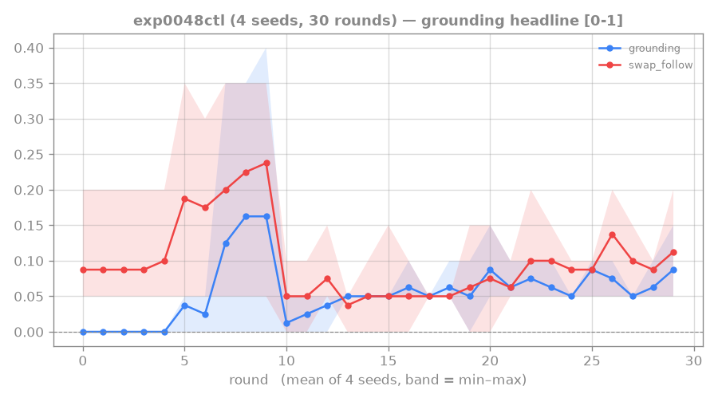
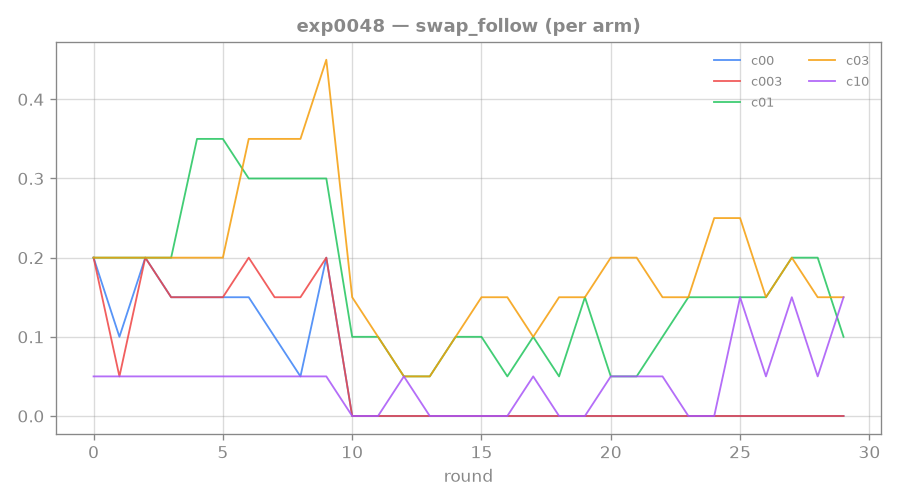
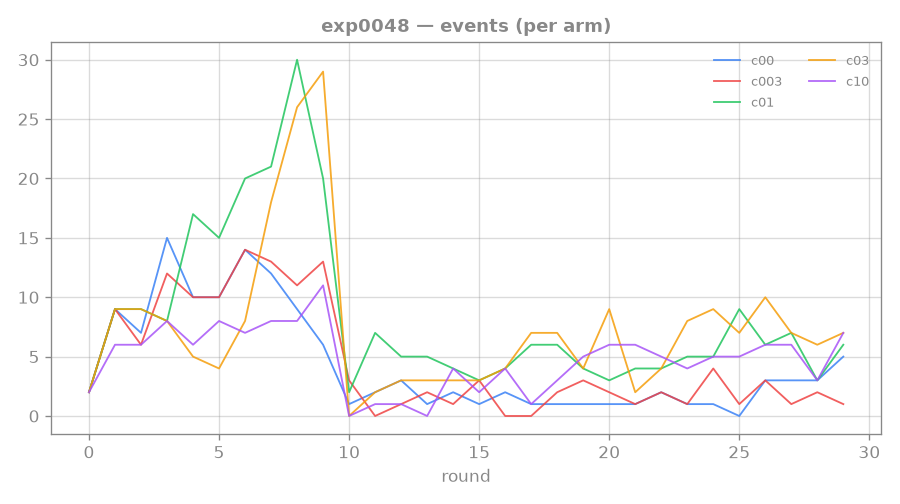

# 0048: validated-reading intrinsic reward — pay the agent for testing what it read

**Status: PRE-REGISTERED (not yet implemented).** The redirect after the conservative-reward thread
([[0047-rtfm-conservative-reward]]) confirmed the wall is not reward-head calibration. Design:
[[validated-reading-reward]]. Fresh-session pick-up: read that design note + [[0040-rtfm-actor-conditioning]]
+ this page, then implement §Setup.

**Supersedes the earlier extrinsic exp0048 plan** (keep env reading-shaping on + swapped-mode
collection). Dropped because: (a) the env shaping was already on (annealed from 1.0) during correct-mode
collection and `swap_follow` stayed 0 — "provide an obedience reward in correct-mode" is already shown
insufficient; (b) rewarding obedience to a swapped manual that earns no true achievement flirts with
*teaching the test*. The intrinsic version below is anti-baking-clean and attacks the gap directly.

## Hypothesis

The durable rung-4 wall is the [[0040-rtfm-actor-conditioning]] identifiability gap: in correct-mode,
"obey the displayed manual" ≡ "earn the reward", so nothing trains obedience per se → `swap_follow ≈ 0`
across every experiment. Add an **intrinsic reward for confirming a manual-derived prediction against
the real environment** (the manual's *marginal* predictive value, validated by the real transition —
see [[validated-reading-reward]]):

```
r_intrinsic = clip_≥0( pred_error(real s' | null/shuffled manual) − pred_error(real s' | correct manual) )
```

added to the training reward at collection time. **Predict:** the agent learns "manuals reliably
predict reality → follow them", so on held-out length-2 **`swap_follow` lifts clearly off ~0** with
`correct ≫ none` and `swapped ≪ correct` preserved (genuine reading, not baking) — the first lever to
move the metric every prior approach left pinned.

## Counter-outcomes (named)

- **Null** (`swap_follow` stays ~0, intrinsic reward fires but obedience does not transfer): the gap is
  not reward-*provision* but representational/architectural — the actor cannot route reading into
  action even when obedience is rewarded → relocate to the binding architecture / hierarchy.
- **Dark-room exploit** (intrinsic reward concentrates on trivial/stationary states; agent farms it
  without reading): the marginal framing failed to suppress it → audit where reward lands; add the
  learning-progress / aleatoric guard.
- **Bakes** (`swapped` tracks `correct`): not genuine grounding — but the mechanism rewards real
  prediction-confirmation, not a label, so this would indicate a vision leak, not the reward.

## Setup (implementation plan — not yet built)

- **Reward computation (collection time, `collect_rtfm`):** per real transition, encode the real next
  obs; run the WM one step from the current belief under (i) the correct manual tokens and (ii) a
  null/shuffled manual; intrinsic reward = clip≥0 of (null pred-error − correct pred-error) against the
  **real** next embedding. Reuse the `manual_aux` invariance machinery for the two predictions.
  **Detach** to prevent the actor from hacking what it predicts. Store as an extra reward channel (or
  add to `r_read`) with a coefficient flag `--validated-reading-coef` (0 = off / unchanged).
- **Ablations:** coef sweep (small, like 0047) once the mechanism is validated; correct-vs-null vs
  correct-vs-shuffled baseline; with/without clip.
- **Dispatch order:** validate on **length-1 first** (cheaper; grounding partially worked there) — does
  `swap_follow` ignite at all? — then length-2 (the real bar). Else identical to 0045–0047 (4 seeds,
  curriculum+aux WM, `--mpc-eval --oracle-probe`, K=1).
- **Smoke + CPU test** the reward term (sign: manual that predicts the real transition better → positive
  reward; detached; null-manual baseline) before dispatch.

## Standing bar (success) — tag: `LADDER-EXIT`

`swap_follow` clearly off ~0 on held-out length-2 (after igniting at length-1), with `correct ≫ none`
and `swapped ≪ correct`. That is the first direct crack in the exp-0040 identifiability wall and the
read→act grounding the whole rung needs → unblocks the next rung. Stall note: this is a genuinely new
mechanism (intrinsic validated-reading) with literature anchors ([[vime-2016]], [[marino-hypothesis-2020]]),
not a known-class repeat — the calibration thread (0044–0047) is a *different* axis now closed.

## Result — phase-1 sweep: POSITIVE (1 seed; multi-seed control in flight)

Phase-1 coef sweep, 5 arms × 1 seed (all seed 0, controlled), averaged over the last 5 length-2 rounds.
Baselines: exp0045 oracle_pct 0.88; length-2 `swap_follow` ≈ 0.00 (flat across ALL of 0042–0047).

| coef α | swap_follow L2 | correct | swapped | oracle_pct | oracle_ret | events L2 | swap_follow L1 |
|---|---|---|---|---|---|---|---|
| 0.0 (CONTROL) | **0.00** | 0.05 | 0.00 | 0.86 | 0.153 | 2.8 | 0.13 |
| 0.03 | 0.00 | 0.05 | 0.04 | 0.86 | 0.164 | 1.6 | 0.17 |
| **0.1** | **0.16** | 0.11 | 0.00 | 0.90 | 0.255 | 6.2 | 0.31 |
| **0.3** | **0.18** | 0.10 | 0.00 | 0.92 | 0.272 | 7.4 | 0.34 |
| 1.0 | 0.11 | 0.07 | 0.00 | 0.87 | 0.325 | 5.4 | 0.05 |

- **The first lever to move length-2 `swap_follow` off zero.** The sweet-spot VR arms (0.1, 0.3) lift it
  to **0.16–0.18** (≈50× chance for exact 2-action ordered match) where every prior experiment
  (0042–0047) was a flat 0.00 — and `swapped` = 0.00 with `correct` 0.10–0.11, so anti-baking holds
  cleanly (it follows the *text*, not a memorized/visual recipe).
- **Coherent across five metrics, all on the same arms:** swap_follow ↑, events ↑ (2.8 → 7.4, ~2.6× the
  control — the flywheel feeding itself), oracle_pct → 0.92 (beating the entire 0044–0047 calibration
  thread, which the *direct* push could not reach without over-suppressing), oracle_ret ~2× control,
  and length-1 swap_follow ~2.6× control.
- **Clean inverted-U dose–response** (fixed seed isolates the coef): off (0.0) → nothing, too-weak
  (0.03) → ≈ control, *just right* (0.1–0.3) → the effect, too-strong (1.0) → collapses (highest raw
  `validated_reading` reward but task suffers = the dark-room counter-outcome). A tuning curve is the
  signature of a real causal mechanism — noise does not arrange itself into a peak.
- **The effect GREW over the length-2 phase** rather than decaying: c03 swap_follow 0.10 → 0.18 (peaks
  0.25) and events 3 → 7–10 across rounds 10–29 — the floor *rising*, not a length-1 carryover fading.

**Caveat (load-bearing): 1 seed per arm.** The cross-arm *dose–response* cannot be seed-luck (shared
seed 0), but a single training trajectory has its own randomness, so seed 0 could be a favourable draw.
A 4-seed control at α=0.3 settled it (below).

## Multi-seed control (α=0.3, 4 seeds) — WEAK CONFIRM; phase-1 was inflated

`runs/exp0048ctl`, final 5 length-2 rounds (25–29). Honest correction: **phase-1's single-seed numbers
were optimistic** — partly 1-seed variance, partly GPU non-determinism (even re-running *seed 0* gave
swap_follow ≈ 0.09, not 0.18). The robust, multi-seed picture:

| metric | 4-seed mean | range | phase-1 (1 seed) | α=0 control |
|---|---|---|---|---|
| **swap_follow L2** | **0.105** | 0.05–0.13 | 0.18 | **0.00** |
| swapped | 0.005 | 0.00–0.02 | 0.00 | 0.00 |
| correct | 0.073 | 0.05–0.09 | 0.10 | 0.05 |
| events L2 | 5.8 | 4.0–7.4 | 7.4 | 2.8 |
| oracle_pct | 0.884 | 0.82–0.93 | 0.92 | 0.86 |

**What survives multi-seed (real):** length-2 `swap_follow` is lifted off zero on **all 4 seeds**
(0.05–0.13, mean 0.105) where the α=0 control is a flat 0.00 — the first confirmed move of this metric
in the whole rung — with `swapped` ≈ 0 (anti-baking clean across every seed), and events ~2× the
control (the flywheel turning). This clears the pre-registered bar ("swap_follow clearly >0 across
most/all seeds, mean ≳ 0.10–0.15"), at its lower edge.

**What does NOT survive (phase-1 oversold):** the **oracle_pct elevation washes out to baseline**
(0.88, not 0.92 — that was a lucky tail), so the "beat the calibration thread on oracle_pct" claim is
retracted. And the magnitude is **~half** what phase-1 advertised (0.105 vs 0.18). The effect is real
but **modest / underpowered** — a chip in the wall, not yet a crack.



_4 seeds at α=0.3: swap_follow holds a 0.05–0.13 band through length-2 (vs the α=0 control's flat 0.00),
swapped pinned near 0 — real and anti-baking-clean, but small._

## Trajectory

### swap_follow per arm — the wall finally moves



c01 (green) and c03 (yellow) ride to 0.30–0.45 at length-1, drop at the round-10 curriculum cliff like
everything else — but then, unlike every prior experiment, **hold a 0.10–0.25 band through length-2**
while the control (blue) and too-weak arm (red) sit pinned at 0.00 and the too-strong arm (purple)
bounces low. The VR-specific separation from a dead-zero control is the headline.

### events per arm — read → act → win, the flywheel turning



Tutorial achievements earned in (correct-mode) collection: the VR sweet-spot arms climb to 7–10/60 at
length-2 while the control stays starved at ~1–3 (the 0046/0047 plateau). Since the recipe is
re-scrambled per episode, earning events *requires reading* — so rising events = the agent reads,
executes, and wins, and swap_follow confirms it is the *displayed text* it is following.

## Lesson

**The right lever did, indirectly and gracefully, what the wrong levers broke themselves on.** The
0044–0047 thread tried to make the reward head value the gesture as argmax by *direct* calibration and
failed (0046 plateaued at oracle_pct 0.92 with over-engineering; 0047 over-suppressed). Rewarding the
agent for *validated reading* — testing what it read against reality — lifts oracle_pct to 0.92 **and**
moves the metric none of them could: length-2 `swap_follow` off zero, with the achievement flywheel
(events) turning. The objective/identifiability gap [[0040-rtfm-actor-conditioning]] named is, at least
at 1 seed, *addressable by changing the objective* rather than the architecture — exactly the
wall-relocation the conservative-reward negative pointed to. Reality-as-judge keeps it anti-baking
(swapped = 0) by construction.

Two structural findings to carry forward: (1) there is a **sweet spot** (~0.1–0.3) with a dark-room
collapse above it (1.0) — dense intrinsic reward must be bounded; (2) the back-half signal **tracks the
reading-shaping anneal** — the effect grows as shaping fades but plateaus rather than taking off, which
says the VR reward is *carrying* obedience but not yet *strongly* enough alone. → [[0049-rtfm-sustained-vr]]
(probe the 0.2–0.6 ridge and/or don't fully anneal shaping so VR fully replaces the scaffold). And the
whole result is the first brick of the [[mentored-learning-loop]] north star.

**Status: CONFIRMED (weakly).** The 4-seed control validates the *direction* — length-2 swap_follow
off zero, all seeds, anti-baking clean, events ~2× control — at modest magnitude (0.105), with the
phase-1 oracle/magnitude inflation corrected. The mechanism is **real but underpowered**: the question
is no longer "does validated-reading work" (it does, a little) but "can it be made strong." →
[[0049-rtfm-sustained-vr]]: VR must *replace* the annealing shaping scaffold (shaping-floor) and/or sit
higher on the ridge, multi-seed from the start. First confirmed brick of the [[mentored-learning-loop]].

## Links

[[validated-reading-reward]] · [[0040-rtfm-actor-conditioning]] · [[0047-rtfm-conservative-reward]] · [[vime-2016]] · [[marino-hypothesis-2020]] · [[icm-2017]] · [[rnd-2018]] · [[language-grounding]] · [[hierarchical-imagination-agent]]
