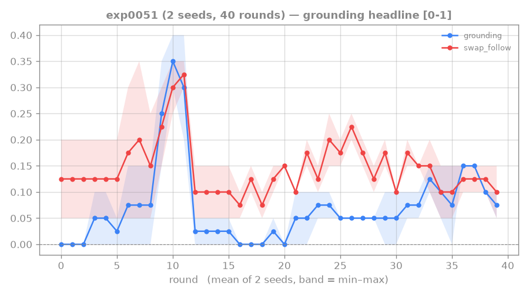
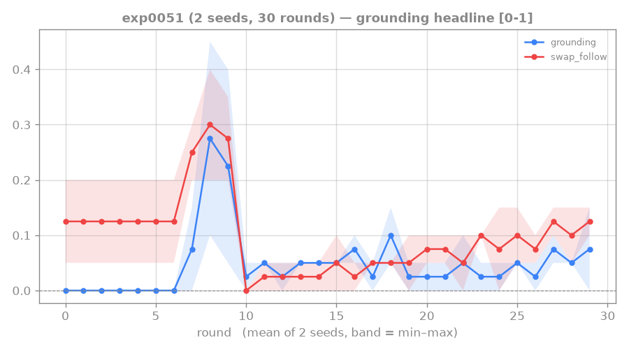

# 0051: optimizing flat validated-reading on the 2-step tutorial (no hierarchy)

After the hierarchy thread concluded negative ([[0050-rtfm-hierarchy]] — wrong tool for a 2-step
gesture; and, the maintainer's key insight, the *worker had no grounding incentive*: every acting
level needs it), the direction is to keep optimizing the **flat** validated-reading architecture
(where the incentive sits directly on the actor) and push the length-2 `swap_follow` ceiling past the
confirmed ~0.10 ([[0048-rtfm-validated-reading]] / [[0049-rtfm-sustained-vr]]).

## Budget probe — the swap_follow ceiling isn't lifted by compute (task completion does climb)

`runs/exp0051budget`: flat VR coef 0.3, **2× budget** (40 rounds, curriculum 12, 800 ac-updates) vs the
30-round/400-update 0.105 baseline. 2 seeds, last-5 length-2:

| | swap_follow | correct |
|---|---|---|
| baseline (30r/400u) | 0.105 | 0.073 |
| **2× budget (40r/800u)** | **0.115** | 0.115 |

**Refined read (the graph corrects an over-claim):** the metrics diverge over the 40 rounds —
- **`correct`/`grounding` (task completion) DOES climb** (seed0 0.00→0.15, seed1 0.05→0.15) — more
  compute buys better task completion;
- **`swap_follow` (the strict held-out reading metric) does NOT** — seed0 bounces ~0.10–0.20 (flat),
  seed1 even peaks ~0.20–0.25 mid-run then falls back to ~0.05–0.10. No sustained climb.

So the precise statement is **not "not compute-bound" but "the swap_follow ceiling specifically is not
lifted by more compute"**: extra rounds improve *completion* but not *swap-following*. The rising
`correct` is plausibly partly **experience-based completion** (finding the achievement by practice) —
the very confound `swap_follow` is built to discount, which is why it stays flat. So the lever for
genuine reading is a stronger/denser grounding incentive, not more rounds. (Caveat: `correct`'s trend
is not fully settled at 40 rounds; the flat-`swap_follow` conclusion is the load-bearing one.)

## coef 0.5 — DONE: coef lever EXHAUSTED

`runs/exp0051c05` (2 seeds): filled the dose-response gap (exp0048 tested 0.1/0.3 ≈ 0.10, 1.0
dark-rooms; 0.5 was the hole). Result: length-2 swap_follow ~0.10 (s0 0.10, s1 0.0–0.15, noisy), **no
better than 0.1/0.3.** Combined with the budget probe, the **coef knob is saturated** — reward strength
cannot move the ~0.10 ceiling. (These checkpoints became the working-baseline substrate for the
[[0053-rtfm-imagination-fidelity]] probe.)

## Outcome — the lever ladder, and the pivot

The on-deck "decoupled/denser actor-VR" idea was built and run as [[0052-rtfm-decoupled-vr-head]]:
**NEGATIVE** — a dedicated, directly-actor-optimized VR head (λ=1.0) collapsed the policy (the actor
reward-hacked the head's OOD over-predictions). So the full lever ladder — objective→folded-VR 0.10,
coef-saturate (here), 2× compute (here), hierarchy ~0 ([[0050-rtfm-hierarchy]]), decoupled head collapse
— shows **pushing the grounding incentive harder keeps failing**. Pivot: localize the wall instead.
[[0053-rtfm-imagination-fidelity]] then showed the WM imagines faithfully → the ~0.10 wall is
**downstream** (policy / reward-readout), not the world model or the grounding-incentive strength.

## Links

[[0048-rtfm-validated-reading]] · [[0049-rtfm-sustained-vr]] · [[0050-rtfm-hierarchy]] · [[validated-reading-reward]] · [[0040-rtfm-actor-conditioning]]
