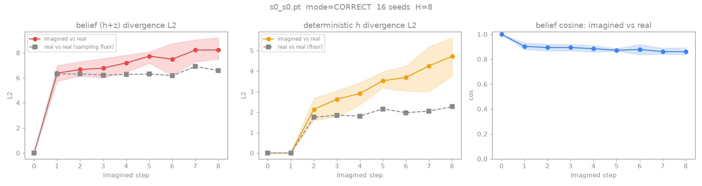

# 0054: reward-gap probe — is the downstream wall the reward READOUT or credit-assignment?

**Status: CONCLUDED.** The reward head is **over-optimistic** (both seeds): atop a faithful world
model, the actor imagines ~+0.7 more cumulative reward over 8 steps than reality delivers. The ~0.10
wall has a confirmed **reward-readout** component (the exp0045 over-rating ghost, now measured on the
*working* baseline). Result below; follows the [[0053-rtfm-imagination-fidelity]] finding that the WM
imagines faithfully, so the wall is downstream of the dynamics.

## Result — reward head OVER-OPTIMISTIC (the fork resolves to the readout)

`runs/exp0054` (folded VR 0.3, new save format with `rew` persisted). Probe = `imagine_report.py`,
H=8, 16 seeds, single checkpoint per seed. "imagined − real reward" = sum over the 8-step imagined
rollout of `rew(belief,action)` minus the real tutorial reward under the same plan:

| | imagined − real reward (sum/H) | h-divergence @ step 8 (÷ floor) |
|---|---|---|
| seed 0, CORRECT | **+0.67** | 2.1× |
| seed 0, SWAPPED | **+0.51** | 2.2× |
| seed 1, CORRECT | **+0.79** | 2.2× |

- **Robustly positive across both seeds** (+0.67 / +0.79 CORRECT). Since this ~0.05–0.08-swap_follow
  agent almost never actually earns (events ≈0–1/round), the real reward over the window is ≈0 — so
  the imagined return is **mostly phantom.** The actor optimises a reward landscape inflated by
  over-prediction on the OOD states it reaches in imagination, which drowns the sparse true
  gesture-reward (1.0, rare).
- **Dynamics remain faithful** (h-divergence ~2× the sampling floor — reproduces
  [[0053-rtfm-imagination-fidelity]]). So this is a reward-*readout* defect, not a world-model one.

_Faithful dynamics (h-divergence near the sampling floor) but the reward head over-predicts — the
"imagined − real reward" line printed +0.67 (seed 0) / +0.79 (seed 1) over the 8-step rollout._

**Caveats:** single checkpoint per seed; modest magnitude; small confound — the head was trained on
`r_read = task + 0.3·VR` while "real" counts only tutorial achievements, so ~0.05 of the +0.7 is the
head correctly predicting the (tiny) VR component the comparison excludes. The directional,
both-seeds over-prediction is robust to this.

## Verdict / next lever

The downstream wall has a **confirmed reward-readout component** → the well-motivated lever is making
the task reward head **conservative on OOD imagined actions** ([[0047-rtfm-conservative-reward]],
CROP/CQL). **But** exp0047's blunt push-down *over-suppressed* — so the next step is *calibrated*
conservatism (gentler/scheduled coef, or uncertainty-aware/ensemble reward head that abstains OOD),
not a naive re-run. If careful reward-calibration still leaves swap_follow at ~0.10, the residual is
**pure credit-assignment / execution** of the 2-step gesture ([[0043-rtfm-execution-wall]]) — needing
planning/horizon, not a reward fix. This is the brainstorm fork.

## Original pre-registration (for the record)

Follows the [[0053-rtfm-imagination-fidelity]] finding: the WM imagines *faithfully*, so the ~0.10
length-2 swap_follow wall is **downstream** of the world model — in the policy / reward-readout. This
run decides *which*.

## Why this run exists (and why it's a fresh train)

exp0053 measured open-loop **belief** fidelity (needs only rssm + encoder) and found it good. The
*direct* test of "the actor optimises a distorted objective" is the **imagined-vs-real reward gap** —
does the task reward head over-predict reward on the OOD states the actor reaches in imagination? That
needs the `rew` head in the checkpoint, which the old save format dropped. The save format now persists
`recon_head`/`rew`/`cont`/`vr_head`, so exp0054 simply **re-runs the working baseline to get a
checkpoint with the reward head saved** — then `scripts/imagine_report.py` reports the reward gap.

## Hypothesis / the fork it decides

Run the confirmed ~0.10 working baseline (folded validated-reading, coef 0.3). Then probe the reward
gap on length-2:

- **Reward head OVER-OPTIMISTIC** (imagined cumulative reward ≫ real): the actor chases phantom reward
  even atop a faithful world model → the wall is the **reward readout** (exp0045 over-rating / exp0052
  VR-head reward-hacking, on the *task* channel). Fix = conservatism on the reward head
  ([[0047-rtfm-conservative-reward]] CROP/CQL), now well-motivated rather than speculative.
- **Reward head FAITHFUL** (imagined ≈ real reward): the readout is fine too → the wall is **pure
  credit-assignment / execution** of the 2-step gesture ([[0043-rtfm-execution-wall]]) — a reactive
  actor can't sequence it regardless of a correct model+reward. Fix lives in planning / horizon /
  a different action-selection tool, not another reward term.

**Predict:** over-optimism (the exp0045 ghost recurs on the task channel). Either way the result picks
the next lever unambiguously — that is the point.

## Setup

- `scripts/dispatch_rtfm.sh exp0054 2 --rounds 30 --curriculum-rounds 10 --length 2
  --manual-aux-coef 1.0 --validated-reading-coef 0.3` (the confirmed ~0.10 baseline config; new save
  format persists the WM heads).
- Harvest: confirm it lands at ~0.10 length-2 swap_follow (sanity vs [[0051-rtfm-flat-vr-optimization]]),
  then `imagine_report.py <ckpt> --mode CORRECT/SWAPPED` → read the "imagined-minus-real reward (sum
  over H)" line + belief/h fidelity (should reproduce exp0053).

## Standing bar — diagnostic (tag: `EXTRA-RIGOR`)

This run SUCCEEDS by producing a clear reward-gap number that selects the branch above; it is a
localization probe, not a swap_follow push. (Reaching ~0.10 just confirms it's the same baseline.)

## Links

[[0053-rtfm-imagination-fidelity]] · [[0045-rtfm-oracle-probe]] · [[0047-rtfm-conservative-reward]] · [[0043-rtfm-execution-wall]] · [[0051-rtfm-flat-vr-optimization]] · [[validated-reading-reward]]
