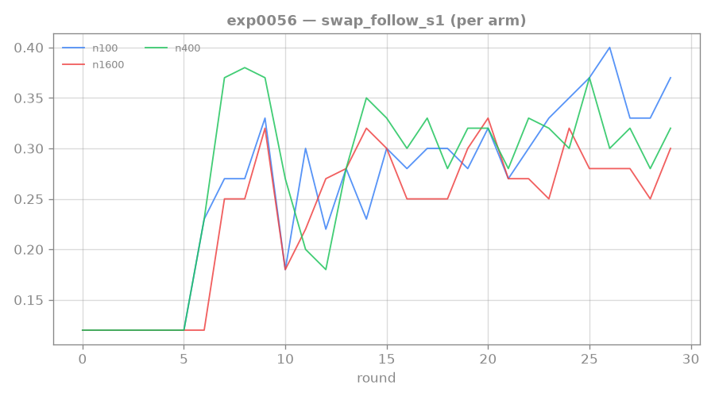
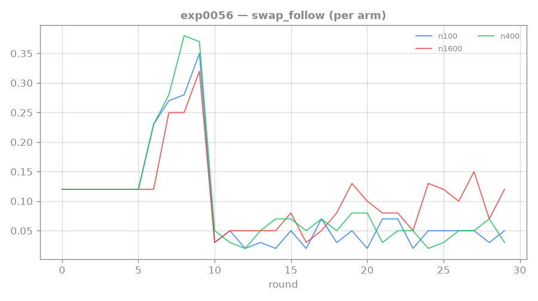

# 0056: coverage sweep — is the 2-step wall combinatorial coverage or compositional binding?

**Status: DONE (1 seed/arm) — PROMISING: coverage helps step-2.** More distinct training recipes
lifted the conditional step-2, supporting the combinatorial-coverage hypothesis. Needs a multi-seed
confirm (single seed). Result:

| n-train (distinct recipes) | step-1 (s1) | exact | **P(step-2\|step-1)** | correct |
|---|---|---|---|---|
| 100 | 0.36 | 0.046 | 0.13 | 0.104 |
| 400 (baseline) | 0.32 | 0.046 | 0.14 | 0.070 |
| **1600** | 0.28 | **0.112** | **0.40** | 0.100 |

**4× more distinct recipes (n1600) ~tripled conditional step-2 (0.14→0.40) and ~2.4× the full chain
(0.046→0.112)**, with step-1 ~flat (even slightly lower). So the depth-2 wall is at least partly
**combinatorial-coverage-bound** — the model induces the chaining rule better with broader recipe
exposure (NOT just more compute on the same distribution — exp0051's 2× budget was flat). Single seed,
so seed-luck is possible; **queue a multi-seed n1600 confirm** + try even higher coverage. Combines
naturally with the path-reward levers ([[0057-rtfm-path-reward]]/[[0058-rtfm-escalating-path-reward]]).

**Multi-seed follow-up ([[0062-rtfm-coverage-confirm]]):** the single-seed n1600 win did NOT replicate at 4 seeds (n1600 exact 0.057 < n400 0.115) — BUT at a fixed 30-round budget n1600 is per-recipe under-trained (~1.1×/recipe vs n400 4.5×), so that's the expected effect of a harder task, NOT a coverage refutation. Coverage's generalization benefit remains untested (needs equal per-recipe exposure / convergence).

## Original pre-registration

Follows the [[0055-rtfm-ensemble-pessimism]] reframe: the rung-4 wall is NOT
reading or reward — it's **2-step composition** (step-1 swap-follow ~0.4, full-chain ~0.08). This run
tests the maintainer's specific hypothesis: does the agent fail to chain two steps because it hasn't
*seen enough distinct recipes* to learn the depth-2 rule (combinatorial coverage), or because it
*can't compose two grounded steps regardless of data* (architectural binding limit)?

## Hypothesis / fork

Vary the number of distinct training recipes (`--n-train-seeds`), hold everything else at the working
baseline, watch **per-step** swap-following (the new `swap_follow_s1` vs exact):

- **Coverage-bound** — full-chain swap_follow (and especially step-2-given-step-1) **rises with more
  distinct recipes** → the lever is more coverage + a curriculum. (Supports the combinatorial view.)
- **Composition-bound** — step-1 stays ~0.4 but the **full chain stays flat (~0.08) regardless of
  coverage** → it's an architectural chaining limit; more data won't fix it → the lever is a
  composition-targeted mechanism (curriculum 2-from-1, progress-tracking, or planning/MPC).

Note the exp0051 2×-budget probe added *compute on the same recipe distribution* and didn't help —
this is different: more *distinct* recipes.

## Setup

`scripts/dispatch_rtfm.sh exp0056n{100,400,1600} 1 --rounds 30 --curriculum-rounds 10 --length 2
--manual-aux-coef 1.0 --validated-reading-coef 0.3 --n-train-seeds {100,400,1600}` (folded-VR working
baseline, single reward head, no pessimism — clean). n400 is the standing baseline reference. Read
swap_follow_s1 (step-1) AND swap_follow (exact) over the last-5 length-2 rounds.

## Standing bar — diagnostic (tag: `EXTRA-RIGOR`)

Succeeds by cleanly separating coverage-bound from composition-bound (a monotone rise vs a flat line).
Either way it picks the next composition lever unambiguously.

## Links

[[0055-rtfm-ensemble-pessimism]] · [[0043-rtfm-execution-wall]] · [[0054-rtfm-reward-gap]] · [[0048-rtfm-validated-reading]] · [[mentored-learning-loop]]
