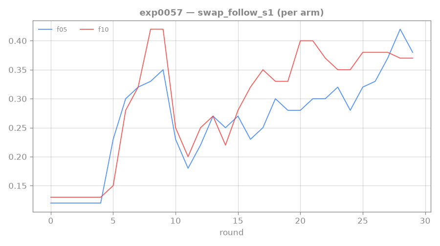
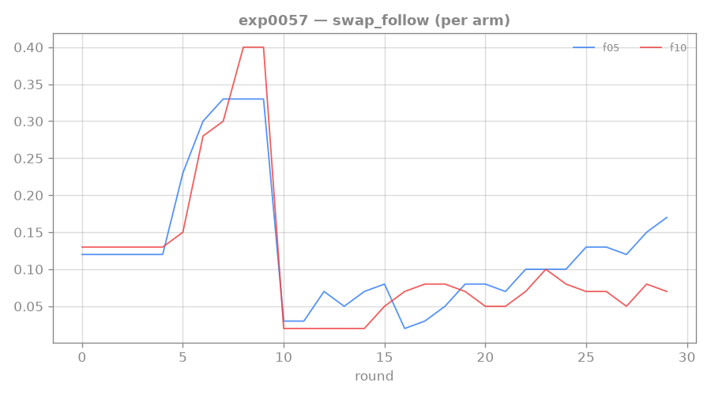

# 0057: reward the PATH — keep the per-step gesture reward instead of annealing it away

**Status: DONE (1 seed/arm) — POSITIVE: floor 0.5 moves conditional step-2 (sweet spot).** Follows the
[[0055-rtfm-ensemble-pessimism]] reframe (wall = 2-step composition, not reading/reward) and the
maintainer's framing: *the path isn't rewarded — but path-following is exactly what we want to train.*
Objective↔reward alignment — we MEASURE path-following (swap_follow), so we should REWARD it. Result
below.

## Key realization: the path reward already exists, and we turn it off

The env's `reading_shaping` (HO-0007) is *already* a per-step path reward: +coef each time the agent
performs the NEXT action of the displayed gesture (pointer advances; resets on a wrong action) — so
step-1 AND step-2 are rewarded, reading-gated. **But we anneal coef 1.0→0 over the run**, and the
length-2 phase (rounds 10–30) is exactly where it fades. We built the path reward and switch it off
when step-2 needs it. Honesty is guaranteed by the SWAPPED/held-out eval (always coef 0), not by
withholding the path reward — so we can keep it dense and stay honest.

## Motivating re-analysis (exp0049 floor 0.2, via the new swap_follow_s1)

| shaping floor | step-1 | exact | P(step-2 \| step-1) |
|---|---|---|---|
| 0 (anneal to 0, baseline) | 0.28 | 0.05 | 0.18 |
| 0.2 (path kept, exp0049, 4 seeds) | **0.42** | 0.07 | 0.17 |

Keeping the path reward at 0.2 **lifted step-1 reading (0.28→0.42)** — "reward the path" works for getting
ON the path — but the **conditional step-2 (~0.17) did not move.** Read: a *uniform* per-step reward
raises how often the agent is on the path (step-1, lots of exposure) but not step-2's conditional
reliability — plausibly because step-2 is only ever practiced AFTER step-1 (a rare state), so it stays
exposure-starved even when rewarded.

## Result — a MODERATE path reward moves conditional step-2 (sweet spot at 0.5)

`--reading-shaping-floor ∈ {0.5, 1.0}` (1 seed each), last-5 length-2, vs the exp0049 floor-0/0.2 refs:

| floor | step-1 (s1) | exact | **P(step-2\|step-1)** |
|---|---|---|---|
| 0 (baseline) | 0.28 | 0.05 | 0.17 |
| 0.2 (exp0049) | 0.42 | 0.07 | 0.17 |
| **0.5** | 0.36 | **0.140** | **0.38** |
| 1.0 | 0.38 | 0.068 | 0.18 |

**Floor 0.5 lifts conditional step-2 to 0.38** (from ~0.17) and exact to 0.14 — the first time a path
reward moved the *conditional*, not just step-1. **Floor 1.0 over-shapes and kills it** (back to 0.18):
there is a magnitude SWEET SPOT. So step-2 was partly reward-magnitude-starved after all — but only in a
band (0.2 too weak, 0.5 right, 1.0 too strong). **Converges with [[0056-rtfm-coverage-sweep]]**: coverage
(n1600) and path-floor 0.5 BOTH land conditional step-2 ≈0.38–0.40 / exact ≈0.11–0.14 — two independent
levers agreeing that the depth-2 wall is movable. Single seed each → needs multi-seed confirm.

Open question carried to [[0058-rtfm-escalating-path-reward]]: does *back-loading* the reward
(escalation) beat a uniform floor-0.5, and is the exposure component still limiting beyond the sweet
spot?

## Multi-seed confirm (exp0059, floor 0.5 × 4 seeds) — REAL but the single seed was optimistic

Confirmed multi-seed in [[0059-rtfm-floor-confirm]] (4-seed mean: step-1 0.36, exact 0.103, conditional 0.285 — real but the single seed was optimistic; exact recovers ~0.10).

## Standing bar — diagnostic (tag: `EXTRA-RIGOR`)

Succeeds by moving (or definitively not moving) the conditional step-2 with a kept/stronger path
reward — picking between "reward magnitude" and "step-2 exposure" as the next lever.

## Links

[[0055-rtfm-ensemble-pessimism]] · [[0056-rtfm-coverage-sweep]] · [[0049-rtfm-sustained-vr]] · [[0043-rtfm-execution-wall]] · [[mentored-learning-loop]]
