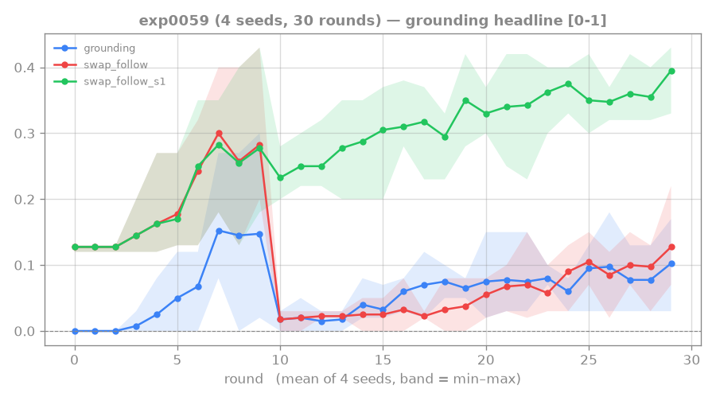

# 0059: multi-seed confirm of the floor-0.5 path reward

**Status: DONE (4 seeds) — floor-0.5 robustly lifts step-1 + conditional, but the single seed was
optimistic; exact lands ~0.10.**

Multi-seed confirmation of the [[0057-rtfm-path-reward]] floor-0.5 single-seed result. The rung-4
wall is 2-step composition: `swap_follow` = exact full-chain match; `swap_follow_s1` = step-1 match;
conditional = P(step-2|step-1) = exact/step1. Baseline: step1 0.28 / exact 0.05 / conditional 0.17.

## Setup

`--rounds 30 --curriculum-rounds 10 --length 2 --manual-aux-coef 1.0 --validated-reading-coef 0.3
--n-train-seeds 400 --reading-shaping-floor 0.5`, 4 seeds (0–3).

## Result

Last-5 length-2 swap_follow metrics:

| seed | step-1 | exact | conditional |
|---|---|---|---|
| 0 | 0.364 | 0.078 | 0.21 |
| 1 | 0.354 | 0.144 | 0.41 |
| 2 | 0.404 | 0.120 | 0.30 |
| 3 | 0.324 | 0.070 | 0.22 |
| **MEAN** | **0.36** | **0.103** | **0.285** |

## Key findings

Floor 0.5 lifts step-1 (0.28→0.36) and conditional step-2 (0.17→0.285) on ALL 4 seeds — real and
consistent. But **exact swap_follow lands ~0.10** (the historical ceiling), because 0.36·0.285 ≈ 0.10:
it improves the components robustly but only *recovers* the ceiling rather than breaking it.

The single-seed [[0057-rtfm-path-reward]] value (exact 0.14 / cond 0.38) was an **optimistic draw**
(honest correction, cf. [[0048-rtfm-validated-reading]] phase-1 inflation). The 4-seed mean is the
authoritative result.

Breaking exact past ~0.10 requires pushing the conditional higher. The coverage lever
([[0060-rtfm-coverage-floor-combo]]) was tested next; back-loading on top of the 0.5 base was tested
in [[0061-rtfm-backloading-confirm]].

## Lesson

Floor-0.5 is a robust, confirmed reward lever: it reliably lifts both step-1 and conditional step-2
across seeds. The single-seed optimism from exp0057 is corrected: exact recovers ~0.10 rather than
exceeding it. The next frontier for exact is the conditional — which exp0061 shows is not
reward-magnitude-limited but exposure/data-bound.

## Links

[[0057-rtfm-path-reward]] · [[0058-rtfm-escalating-path-reward]] · [[0056-rtfm-coverage-sweep]] · [[0048-rtfm-validated-reading]]
