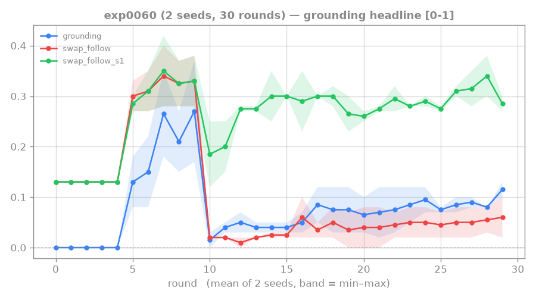

# 0060: coverage × floor-0.5 combined — no stacking

**Status: DONE (2 seeds) — combining the two convergent levers (coverage n1600 + floor 0.5) did NOT
stack; inconclusive/possibly negative at 2 seeds.**

Both [[0056-rtfm-coverage-sweep]] (n1600) and [[0057-rtfm-path-reward]] (floor 0.5) independently
landed conditional step-2 ≈ 0.38–0.40 / exact ≈ 0.11–0.14. This experiment tests whether combining
them stacks additively. Rung-4 wall context: `swap_follow` = exact full-chain match;
`swap_follow_s1` = step-1 match; conditional = P(step-2|step-1). Baseline: step1 0.28 / exact 0.05 /
conditional 0.17.

## Setup

Same as [[0059-rtfm-floor-confirm]] but `--n-train-seeds 1600 --reading-shaping-floor 0.5`, 2 seeds.

## Result

Last-5 length-2:

| seed | step-1 | exact | conditional |
|---|---|---|---|
| 0 | 0.326 | 0.022 | 0.07 |
| 1 | 0.284 | 0.082 | 0.29 |
| **MEAN** | **0.305** | **0.052** | **0.18** |

Mean exact 0.052 is **below floor-0.5 alone (exact 0.103 from [[0059-rtfm-floor-confirm]])** — no
synergy observed.

## Key findings

Combining coverage n1600 and floor-0.5 did NOT produce additive gains. The mean exact (0.052) falls
below the floor-0.5-alone result (0.103), with seed0 in particular showing a near-floor conditional
(0.07). This is **inconclusive rather than a firm negative** at only 2 seeds — seed variance is high
enough (0.07 vs 0.29 conditional across the two seeds) that the combo could still be neutral or mildly
positive with more seeds.

## Lesson

Do not assume independent levers stack. Coverage n1600 and floor-0.5 each work in isolation, but
combining them at 2 seeds shows no benefit and possibly noise-negative performance. A 4-seed confirm
of the combination would be needed before ruling it in or out as a strategy. For now, uniform floor-0.5
at n-train 400 ([[0059-rtfm-floor-confirm]]) is the cleaner, confirmed result.

## Links

[[0056-rtfm-coverage-sweep]] · [[0057-rtfm-path-reward]] · [[0059-rtfm-floor-confirm]]
