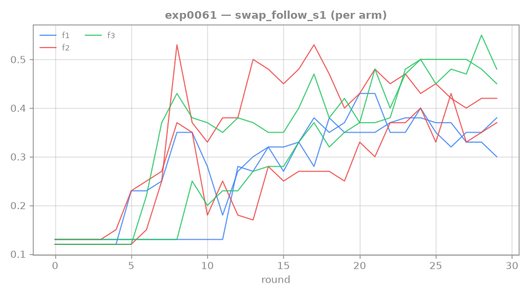
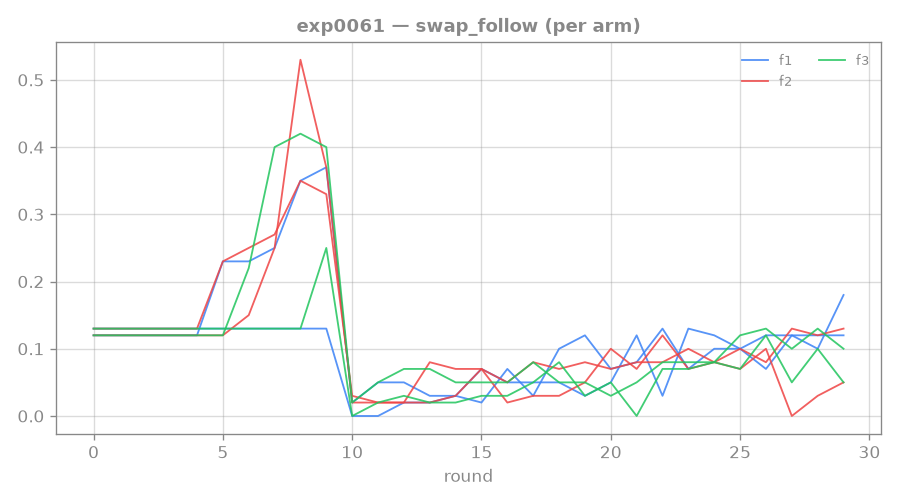

# 0061: back-loading done right (base 0.5) — REFUTED

**Status: DONE (2 seeds/arm) — back-loading the reward HURTS the conditional; uniform-0.5 is the
reward winner.**

This is the properly-parameterized redo of [[0058-rtfm-escalating-path-reward]], which had confounded
its result by starving step-1 with base coef 0.2. Here we fix the base at 0.5 (the working level from
[[0057-rtfm-path-reward]]) and vary only the escalation factor. Rung-4 wall context: `swap_follow` =
exact full-chain match; `swap_follow_s1` = step-1 match; conditional = P(step-2|step-1). Baseline:
step1 0.28 / exact 0.05 / conditional 0.17.

## Setup

`--path-reward-coef 0.5 --path-reward-factor {1,2,3} --path-reward-decay 1.0`, baseline else
(n-train 400), 2 seeds each arm.

- factor 1: uniform 0.5 per step (replicates floor-0.5 from [[0057-rtfm-path-reward]])
- factor 2: step-2 reward = 1.0 (back-loaded)
- factor 3: step-2 reward = 1.5 (more back-loaded)

## Result

Mean of 2 seeds, last-5 length-2:

| factor | step-1 | exact | conditional |
|---|---|---|---|
| **1 (uniform 0.5)** | 0.345 | **0.115** | **0.33** |
| 2 (back-loaded) | 0.392 | 0.081 | 0.21 |
| 3 (more back-loaded) | 0.486 | 0.097 | 0.20 |

## Key findings

**Back-loading HURTS the conditional** (0.33 → 0.21 → 0.20). Bigger step-2 reward makes the agent
attempt step-1 MORE — chasing the larger downstream payoff pushes step-1 all the way to 0.49 at
factor 3 — but the agent follows through WORSE. The conditional is therefore **NOT
step-2-reward-magnitude-limited**.

This **refutes the satisficing hypothesis** from [[0058-rtfm-escalating-path-reward]]: the bottleneck
is not that step-2 is under-rewarded relative to step-1, but rather exposure and execution — a
data/coverage axis problem.

**Uniform 0.5 every time (factor 1) is the robust reward winner** (exact 0.115, cond 0.33) — a 2nd
independent confirmation of the floor-0.5 lever from [[0059-rtfm-floor-confirm]].

## Lesson

The satisficing hypothesis (step-2 is reward-magnitude-starved, so escalation helps) is REFUTED at the
properly-parameterized level. Back-loading increases step-1 attempts but decreases conditional
completion: the agent chases the payoff entry point more aggressively but bails on the follow-through.
The conditional push must come from the **exposure/coverage axis** — more distinct recipes
([[0062-rtfm-coverage-confirm]]) or a backward curriculum — not from reward shape. Reward design is
concluded: uniform floor-0.5 is the answer.

## Links

[[0058-rtfm-escalating-path-reward]] · [[0057-rtfm-path-reward]] · [[0062-rtfm-coverage-confirm]] · [[0043-rtfm-execution-wall]]
