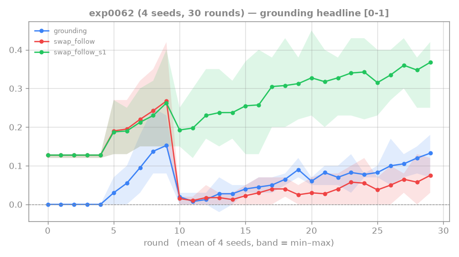

# 0062: coverage confirm — is the step-2 conditional data/exposure-bound?

**Status: DONE (4 seeds) — INCONCLUSIVE / CONFOUNDED, not a clean coverage test.** n1600 scores below
n400, but at a fixed 30-round budget that is **the expected effect of a harder task** (4× the distinct
recipes = 4× as much to learn, ~4× less practice per recipe), NOT evidence that coverage fails to help
generalization. A fair test must equalize per-recipe exposure (or train to convergence).

## Result — n1600 < n400 at 30 rounds, but the comparison is confounded

n1600 × uniform-0.5 path reward, 4 seeds, last-5 length-2:

| | step-1 | exact | conditional |
|---|---|---|---|
| seed 0 | 0.374 | 0.090 | 0.24 |
| seed 1 | 0.260 | 0.012 | 0.05 |
| seed 2 | 0.350 | 0.076 | 0.22 |
| seed 3 | 0.396 | 0.050 | 0.13 |
| **MEAN** | **0.345** | **0.057** | **0.16** |
| n400, same reward (exp0061f1, 2 seeds) | 0.345 | **0.115** | 0.33 |
| single-seed n1600 (exp0056) that motivated this | 0.28 | *0.112* | *0.40* |

**Why this is EXPECTED, not a coverage refutation (the load-bearing point):** swap_follow is on
held-out recipes, so this is a *generalization* question — and the standard view is that more diverse
training data helps generalization *at sufficient budget*. But at a FIXED 30-round budget, n1600 sees
each recipe only **~1.1×** (30·60/1600) vs n400's **~4.5×**: learning to do 1600 different tutorials is
simply harder than 400 with the same practice, so n1600 under-fits and scores lower. step-1 is
unchanged (0.345) — coverage doesn't hurt reading, it's the under-trained conditional that drops.
The single-seed [[0056-rtfm-coverage-sweep]] n1600 (0.112/0.40) was an optimistic draw on top of an
already-noisy under-fit regime.

**So coverage's generalization benefit is UNTESTED here — exp0062 is in the under-fit regime.** A clean
test needs **equal per-recipe exposure** (n1600 needs ~4× the rounds of n400 to match its 4.5×/recipe,
i.e. ~120 rounds) or both trained to convergence. CAVEAT for [[0063-rtfm-long-run-ceiling]]: even at 80
rounds n1600 only reaches ~3×/recipe — still *below* n400@30r's 4.5× — so an exp0063 plateau would
remain ambiguous (could still be under-training). Trend: per-round swap_follow rounds 20–29 drift
0.03→0.08 (gently rising, lower level than n400).

## Original pre-registration

Decides the lever for the step-2 *conditional*, the now-localized nut of the 2-step composition wall.

## Why this run (what the night established)

The reward-shape axis is exhausted and points elsewhere:
- [[0057-rtfm-path-reward]] / [[0059-rtfm-floor-confirm]]: a **uniform path reward (~0.5)** robustly lifts step-1
  (0.28→0.36) and the **conditional P(step-2|step-1)** (0.17→~0.30) across seeds — the confirmed reward
  lever — but only recovers exact swap_follow ~0.10 (0.36·0.30 ≈ 0.10).
- [[0058-rtfm-escalating-path-reward]] / [[0061-rtfm-backloading-confirm]]: **back-loading the reward REFUTED** — making step-2
  worth more *lowers* the conditional (0.33→0.20); the agent attempts step-1 more but follows through
  worse. So the conditional is **NOT step-2-reward-magnitude-limited.**
- [[0056-rtfm-coverage-sweep]] (1 seed): more distinct recipes (n1600) lifted the conditional to ~0.40.

Converging read: the conditional is **exposure / data-bound** — the model can't reliably *execute*
step-2 given step-1, and it improves with broader recipe exposure, not with more step-2 reward. This
run tests that robustly.

## Hypothesis / fork

Run n-train-seeds **1600** (4× recipes) at the **confirmed working reward** (uniform-0.5 path reward:
`--path-reward-coef 0.5 --path-reward-factor 1 --path-reward-decay 1.0`), 4 seeds. Compare against
[[0061-rtfm-backloading-confirm]] factor-1 (n400, same reward) — the only difference is coverage.

- **Conditional rises with coverage (n1600 > n400)** → the wall is **data/exposure-bound** (the
  maintainer's combinatorial hypothesis, now at multi-seed) → levers: more coverage + a **backward
  curriculum** (practice step-2 from step-1-done states; needs code → reviewer-gate).
- **Conditional flat** → not data-bound either → a deeper representational/binding limit at depth-2
  → revisit the architecture (e.g. progress-state in the actor, or a structured/compositional reader).

## Setup

`scripts/dispatch_rtfm.sh exp0062 4 --rounds 30 --curriculum-rounds 10 --length 2 --manual-aux-coef
1.0 --validated-reading-coef 0.3 --n-train-seeds 1600 --path-reward-coef 0.5 --path-reward-factor 1
--path-reward-decay 1.0`. Read last-5 length-2 step-1 / exact / conditional vs the n400 reference.

## Standing bar — diagnostic (tag: `EXTRA-RIGOR`)

Multi-seed: does coverage robustly lift the conditional above the n400 ~0.30? Either result picks the
next lever unambiguously (more-data/backward-curriculum vs architectural).

## Links

[[0056-rtfm-coverage-sweep]] · [[0057-rtfm-path-reward]] · [[0058-rtfm-escalating-path-reward]] · [[0061-rtfm-backloading-confirm]] · [[0055-rtfm-ensemble-pessimism]] · [[mentored-learning-loop]]
