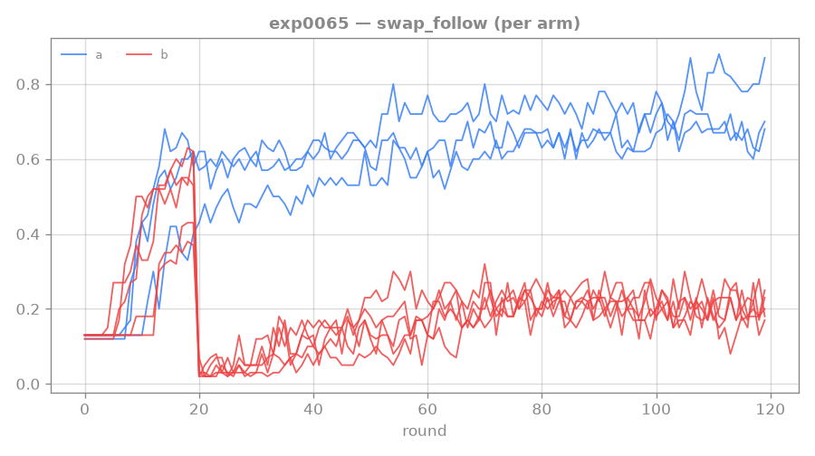
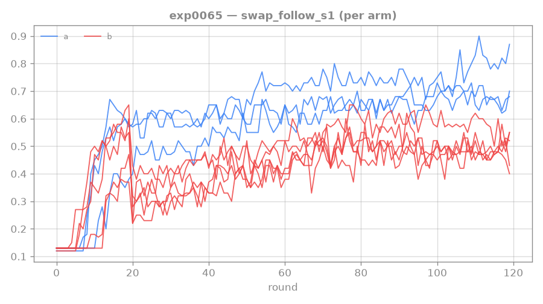

# 0065: per-step swap-follow plateau over a LARGE budget — does 1-step and 2-step composition plateau or keep climbing?

**Status: DONE (len-1 ×3, len-2 ×5, 120 rounds) — the old ~0.10 ceiling WAS a training-length artifact,
but the break PLATEAUS at ~0.20 (an acceptable competent ceiling), and it GENERALIZES across all seeds.**
The full 2-step `swap_follow` climbed 0.04 → ~0.20 and then sat flat from r79–119; all 5 seeds converged
to 0.186–0.210 (sd **0.010**) — so the mid-run s3 "breakthrough" was not a lucky outlier, every seed
reaches the same plateau given budget. But ~0.20 is well below the length-1 ceiling (0.70): the 2-step
composition is cracked, not solved. → motivates [[0066-rtfm-imagination-backward-curriculum]] (the
composition mechanism), now implemented + pre-registered.

## Result (last-5 of 120 rounds)

| | step-1 (s1) | full (swap_follow) | conditional | swapped |
|---|---|---|---|---|
| **len-2** mean (5 seeds) | 0.497 | **0.199** (sd 0.010) | 0.40 | ~0.01 |
| len-1 reference (3 seeds) | — | **0.705** | — | — |

Per-seed len-2 full: [0.186, 0.190, 0.200, 0.208, 0.210] — **variance collapsed** (all ~0.20).

**Trajectory (mean full, plateau vs climb):** r29 0.04 → r39 0.12 → r49 0.17 → r69 0.19 → r79 0.21 →
… → r119 0.21. A clean **climb-then-plateau**: cracks the old ~0.10 wall by ~r60, settles at ~0.20 by
r79, flat (within noise) for the last 40 rounds. At n400/120 rounds (~18×/recipe, converged) this is a
*real* plateau, not under-training.

**Is ~0.20 an *acceptable* ceiling (the [[0063-rtfm-long-run-ceiling]] bar)? YES on every criterion:**
step-1 0.50 (≳0.35 ✓), conditional 0.40 (≳0.30 ✓), `swapped ≈ 0.01 ≪ correct` (honest ✓), low
cross-seed variance + stable r79–119 (✓). So the agent **acts confidently** — reads, does step-1 ~half
the time, and *chains step-2 ~40% of the time given step-1*, consistently across seeds. The residual gap
(full 0.20 vs the 0.70 single-step ceiling) is **genuine 2-step composition difficulty**, not a training
failure → the next lever is the composition mechanism, not more budget or reward.

**Two findings that reshape the exp0066 framing:**
1. **The exploration/credit lottery SELF-RESOLVES at length-2 given enough budget** — all seeds converge
   to ~0.20 by r120 (the mid-run spread 0.08–0.30 was transient). So at length-2 the backward curriculum's
   value is **sample-efficiency** (reach ~0.20 in far fewer rounds — OFF is only ~0.04 at r29) and **lifting
   the plateau** (if ~0.20 is exploration-limited), NOT rescuing permanently-stuck seeds. Its *necessity*
   shows up at **depth ≥3**, where p^(k-1) makes "given enough budget" astronomically long.
2. **Step-1 inside the 2-step task (0.50) lags the pure single-step ceiling (0.70)** — doing step-1 *while
   also needing step-2* is harder than step-1 alone; some of the gap is there, the rest in the 0.40
   conditional.





## Original pre-registration

Operationalizes the [[0063-rtfm-long-run-ceiling]] still-rising-vs-plateau question, sharpened on four
axes: (a) **per-step** tracking (step-1 = `swap_follow_s1`, full 2-step = `swap_follow`), (b) a
**length-1 reference** arm (the achievable single-step ceiling), (c) a **larger budget** — 120 rounds,
~18×/recipe at n400 (well into the converged regime, so a flat tail is a *real* plateau), (d) **more
seeds** per the exp0064 noise lesson. Ran as a [[rtfm-rollout-perf]] exploit: both arms concurrent.

## Interim analysis (MID-RUN, ~round 56 — partially SUPERSEDED by the final result)

> **Superseded:** the mid-run "s3 is a lone breakthrough / s0,s4 are stuck laggards" reading did NOT
> hold — by r120 all 5 seeds converged to ~0.20 (sd 0.010). The *mechanism* below (chaining is the wall,
> an exploration/credit lottery) stands; the *between-seed* spread was transient, not a permanent
> lucky-seed effect. Kept for the dissection method and the exp0066 motivation.


A seed-level dissection of the length-2 arm while it runs, because the spread is mechanistically
informative. **The differentiator between breakthrough and laggard is the conditional P(step-2 | step-1)
— the chaining — NOT step-1 skill.**

| seed | step-1 | full | conditional | 1-step skill entering len-2 | broke ≥0.18 |
|---|---|---|---|---|---|
| s0 | 0.45 | 0.08 | 0.18 | 0.57 | not yet |
| s1 | 0.37 | 0.17 | 0.46 | 0.43 | not yet |
| s2 | 0.38 | 0.18 | 0.47 | 0.37 | round 34 |
| s3 | 0.50 | 0.28 | 0.56 | 0.61 | round 46 |
| s4 | 0.35 | 0.05 | 0.14 | 0.54 | not yet |

Composers (s1/s2/s3) sit at conditional 0.46–0.56; laggards (s0/s4) at 0.14–0.18. **Rules out the
obvious stories:** (a) NOT the 1-step foundation — s0 entered length-2 with a strong 0.57 single-step
skill and never composed, while s2 entered with the *worst* (0.37) and composed *earliest* (round 34);
the starkest case is s0 (step-1 0.45, conditional 0.18 — does the first step well, almost never chains).
(b) NOT reward shape/magnitude — back-loading refuted ([[0061-rtfm-backloading-confirm]]), magnitude null
([[0064-rtfm-path-reward-coef-sweep]]).

**Mechanism (all seeds identical but for the random seed):** the unlock is an *exploration/credit lottery
for the later step*. Step-k states are visited ~p^(k-1) of the time (p ≈ step success ≈ 0.4), so the deep
tail is reached exponentially rarely; the path reward only reinforces step-k when the agent happens to
execute it in order. Composer seeds stumbled into that experience; s0/s4 didn't. This is **learnable and
not architectural** (3/5 seeds prove it) — a high-variance composition unlock. It scales *badly*: at
length 4–5 every seed would be a laggard.

**Lever → exp0066 (backward curriculum in IMAGINATION).** Manufacture the deep-step experience that s3
got by luck: mine the buffer for prefix-complete LATENT states (we already track the recipe-progress
pointer), seed imagination rollouts there (oversample by steps-remaining), and train the actor-critic to
complete the tail. **Imagination, not the real env, because step k-1 is usually a causal *precondition*
for step k** — you can't reset reality to a step-k-ready state without doing step k-1 (and crafter-rtfm
can't snapshot mid-recipe without an env handoff); a believed-done latent sidesteps that. Caveat: only
trustworthy one step past the frontier (WM must have seen real step-k transitions, else hallucinated
dynamics) → walk the curriculum back *gradually* so WM + policy co-evolve; critical at depth ≥3. Pairs
with a progress-aware actor/critic (condition on the recipe pointer → per-step credit). Lit-first
(reverse-curriculum / backplay / Go-Explore / HER) before building; reviewer-gated.

## Why

The reward axis is exhausted ([[0064-rtfm-path-reward-coef-sweep]]: magnitude is a null; back-loading
refuted in [[0061-rtfm-backloading-confirm]]). The live, untested question is whether the ~0.10–0.15
full-2-step `swap_follow` is a **real ceiling** or a **training-length artifact** — the 2026-06-17 audit
found it still gently rising at round 30, never run long. n400 at 120 rounds settles that cleanly: a flat
tail there is a genuine plateau, not under-training. The length-1 arm anchors the contrast — it tells us
the ceiling the single-step skill saturates at, so the length-2 gaps (Arm-A ceiling → Arm-B step-1 →
Arm-B full) localize exactly where competence stops.

## Hypothesis / fork

Two arms, proven config (n400, uniform-0.5 path reward, manual-aux 1.0, VR 0.3), 120 rounds. Read the
**whole trajectory** (not last-5) per arm — plateau vs continued slow climb is the question.

- **Arm A — length 1:** does pure single-step swap-follow plateau, and at what level? (the achievable
  1-step ceiling). Expect it to saturate; *where* is the reference.
- **Arm B — length 2:** track `swap_follow_s1` (step-1 within the 2-step task) and `swap_follow` (full
  chain). Does step-1 climb toward Arm-A's ceiling? Does the full chain plateau (~0.10–0.15) or keep
  climbing past ~0.15?

Forks:
- **Full 2-step keeps climbing past ~0.15** → the ceiling was a training-length artifact; composition
  cracks with enough budget → push budget / a real rung-4 break.
- **Full plateaus, step-1 high & near Arm-A's ceiling, `swapped ≈ 0`** → an *acceptable* competent
  ceiling (the [[0063-rtfm-long-run-ceiling]] framing): the agent reads + does step-1 reliably, the
  residual is genuine 2-step composition difficulty → next lever is the composition mechanism
  (backward curriculum / architecture), not budget or reward.
- **Full plateaus low AND step-1 also low / well below Arm-A** → step-1 itself doesn't transfer into the
  2-step task → an upstream representation/curriculum problem, not just composition.

## Setup

Two parallel dispatches; read full per-round trajectories of `swap_follow` + `swap_follow_s1`:

```
# Arm A — length 1 reference (3 seeds): pure 1-step, no curriculum, swap_follow == step-1
scripts/dispatch_rtfm.sh exp0065a 3 --rounds 120 --curriculum-rounds 0 --length 1 \
  --manual-aux-coef 1.0 --validated-reading-coef 0.3 --n-train-seeds 400 \
  --path-reward-coef 0.5 --path-reward-factor 1 --path-reward-decay 1.0

# Arm B — length 2 (5 seeds): 20 curriculum + 100 length-2; track s1 (step-1) + swap_follow (full)
scripts/dispatch_rtfm.sh exp0065b 5 --rounds 120 --curriculum-rounds 20 --length 2 \
  --manual-aux-coef 1.0 --validated-reading-coef 0.3 --n-train-seeds 400 \
  --path-reward-coef 0.5 --path-reward-factor 1 --path-reward-decay 1.0
```

8 procs concurrent (3 + 5); ~overnight wall (~120 rounds). Larger seed counts than exp0064 (noise
lesson). Plot the full trajectories at the end (`plot_experiment --compare`).

## Standing bar — tag: `LADDER-EXIT`

Whether full-2-step `swap_follow` plateaus or keeps climbing under a converged-regime budget — and, if it
plateaus, whether step-1 sits high enough (near the length-1 ceiling, `swapped ≈ 0`) to call it an
*acceptable competent* ceiling vs an upstream failure. Either resolves the rung-4 next-lever cleanly
(budget/break vs composition-mechanism vs representation).

## Links

[[0063-rtfm-long-run-ceiling]] · [[0064-rtfm-path-reward-coef-sweep]] · [[0061-rtfm-backloading-confirm]] · [[0057-rtfm-path-reward]] · [[rtfm-rollout-perf]] · [[mentored-learning-loop]]
