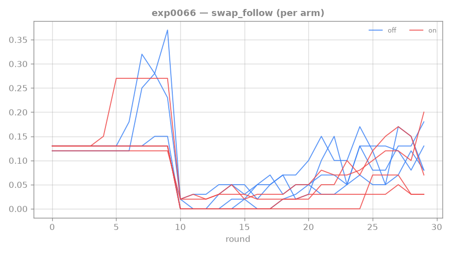
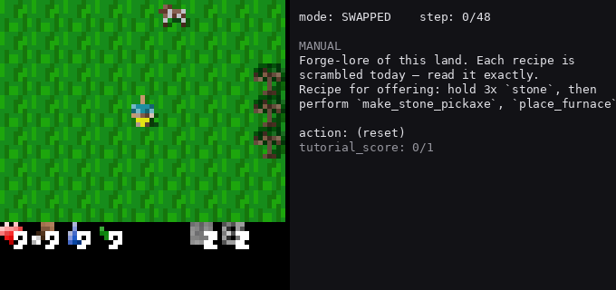
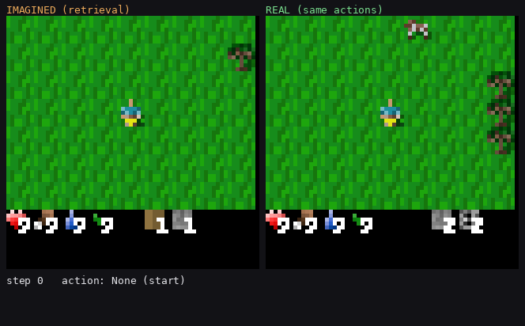
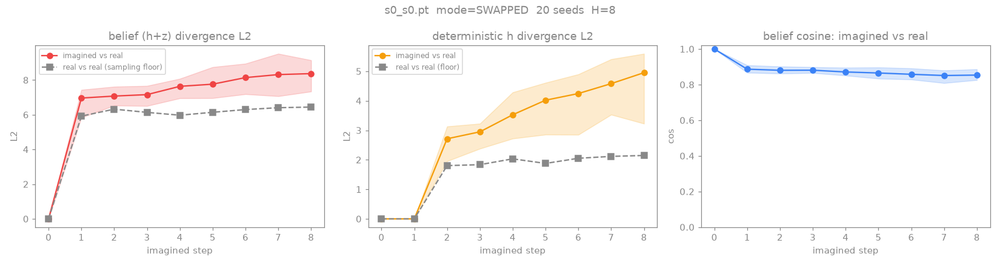

# 0066: imagination backward curriculum — does seeding the actor from prefix-done states crack the step-2 conditional (and shrink seed variance)?

**Status: v1 RUN (30 rounds, 4+4 seeds) — NO help, slightly HURTS + DESTABILIZES; supply healthy, so it's
PREMATURITY not starvation. Decisive longer-budget control dispatched ([[#follow-up]]).** Not a refutation
of the lever — a "too early" result consistent with the §3a WM-fidelity caveat. Code committed 32a2fe0,
reviewer-gated (off-by-one `burn_in-2` caught + fixed before any run).

## Result — v1 (length-2, 30 rounds, last-5)

| arm | step-1 | full (swap_follow) | conditional | bc_realized_frac |
|---|---|---|---|---|
| OFF (baseline) | 0.403 | **0.106** (sd 0.019) | 0.26 | — |
| ON (`--bc-frac 0.5`) | 0.384 | **0.087** (sd **0.044**) | 0.23 | **0.58** (target 0.50) |

ON is slightly LOWER and **2.3× more variable** than OFF. **Supply is healthy** (`bc_realized_frac` 0.58 >
target — the prefix-done pool was well-supplied, so this is NOT the §3a buffer-supply risk). The ON seeds
are **bimodal**: s0/s1 = 0.128/0.132 (*above* OFF), s2/s3 = 0.054/0.034 (*collapsed*). The curriculum
**helped some seeds and broke others** — it increases variance.



**Read → premature, not refuted (the §3a co-evolution caveat biting).** At 30 rounds the WM is immature:
imagination is only trustworthy one step past the frontier, which requires the WM to have learned step-2
dynamics from *real* data first — but [[0065-rtfm-per-step-plateau-large-budget]] showed the conditional
only develops over ~50–80 rounds. So the curriculum seeded the frontier *before* the WM/reward-head could
model the completion, training the actor on hallucinated dynamics for the unlucky seeds (the bimodality =
seed-dependent WM quality at the frontier). And at length-2 the wall **self-resolves** given budget
(exp0065), so here the curriculum competes with an already-working process while the WM is too raw to add
value. Two suspected contributors, to disambiguate next: (a) **WM immaturity at 30 rounds** (primary), and
(b) the **length-1 contamination** caveat — during the length-1 curriculum rounds the pool's `gp==1` states
are length-1-COMPLETE, not the length-2 frontier, so early curriculum updates seed the wrong states.

## Interpretability — what the WM actually imagines (gameplay + dream-vs-reality GIFs)

To *see* why the curriculum hurt, rendered the v1 ON (curriculum) checkpoint: a gameplay clip (the agent
reading a SWAPPED manual and acting) and an imagination clip (the WM's imagined rollout decoded by
nearest-neighbour retrieval — it predicts DINO latents, we have no pixel decoder — side-by-side with
reality executing the same action plan).





**The diagnostic number — the curriculum AMPLIFIED imagined-reward over-optimism.** Imagined-minus-real
reward over the horizon: **ON +2.30 vs OFF +1.75** (>0 = the WM imagines more reward than reality
delivers). State-fidelity was ~equal (belief L2 ~8.4 vs a ~6.4 sampling floor; cos ~0.85 both). So the
backward curriculum didn't make the *dream* diverge more in state — it made the actor **chase reward the
WM hallucinates**, harder. That is the mechanism behind the bimodal collapse: training the actor on
imagined rollouts from prefix-done seeds, on a WM whose reward head over-predicts at the frontier, pulls
the unlucky seeds toward fantasy reward. Confirms the §3a "imagination only trustworthy where the WM is
faithful" caveat is the binding constraint, and that the missing prerequisite is **calibration**
([[hierarchical-imagination-agent]] §5), not the curriculum mechanism itself.



## Follow-up — the prematurity control (length-2, 80 rounds) — STOPPED

Ran briefly (to ~r32: ON 0.07 still trailing OFF 0.13, one ON seed collapsed to 0) then **stopped** — the
direction shifted to the more decisive question: does the curriculum help at **length-3**, where the wall
does NOT self-resolve (the depth where the lever should actually be needed)? That is the next experiment
(pending — a break first).

## Original follow-up plan

`exp0066off80` vs `exp0066on80`: same config at **80 rounds** (OFF should reproduce exp0065's ~0.20
plateau on a *mature* WM). Question: once the WM has learned step-2 (~r50+), does the curriculum help —
reach the plateau **faster** and/or **lift it** — and does the bimodal destabilization resolve to
consistent gain? If ON ≥ OFF at 80 rounds → the v1 hurt was prematurity, the lever works once the WM is
ready (→ add a curriculum **warmup** + fix the length-1 contamination). If ON < OFF even at 80 rounds →
the curriculum genuinely doesn't help length-2 (its value is at depth ≥3, where self-resolution fails).

## Why

[[0065-rtfm-per-step-plateau-large-budget]] localized the 2-step wall to the **conditional
P(step-2|step-1)** — a high-variance **exploration/credit lottery** for the later step (deep states
visited ~p^(k-1); some seeds stumble into step-2, most don't). The reward axis is exhausted
([[0064-rtfm-path-reward-coef-sweep]] null; back-loading refuted). The lever
([[hierarchical-imagination-agent]] §3a, lit-grounded by [[romi-2021]]/[[florensa-2017]]/[[lexa-2021]]):
**manufacture the step-2-completion experience** by seeding the actor-critic's imagination START
distribution from REAL buffered step-1-done latents (oversample `bc-frac` of starts), so every seed gets
the dense tail-credit that only the lucky seeds (s3) found by exploration.

## Hypothesis / fork

ON vs OFF at normal length (length-2, 30 rounds = 10 curriculum + 20 length-2), multi-seed, proven config.
Read `swap_follow` (full 2-step), `swap_follow_s1` (step-1), the conditional, AND `bc_realized_frac`
(buffer-supply telemetry — if ≪ `bc-frac`, the prefix-done pool is starved, the §3a supply risk).

- **ON lifts the conditional above OFF (multi-seed) AND shrinks seed variance** (the laggard seeds catch
  up — they get the experience s3 lucked into) → the backward curriculum cracks the composition wall; the
  first mechanism beyond reward to move step-2 → scale toward length-3 (the bootstrap).
- **ON ≈ OFF** → no help at length-2. First check `bc_realized_frac`: if starved, it's a buffer-supply
  problem (need more/active seeding), not a refutation of the mechanism. If supply is healthy and still
  flat → the imagination seeding isn't sufficient at depth-2 → reconsider (frontier definition,
  conditioning, or the WM-fidelity-at-frontier caveat).
- **ON < OFF / unstable** → imagination seeding HURTS — likely the §3a co-evolution caveat biting (WM
  infidelity one step past the frontier → training the actor on poorly-modeled states). Watch
  imagined_return / recon for divergence; would argue for a shorter horizon or a stricter frontier gate.

**Step-1 should be ~unchanged** (the curriculum targets step-2 specifically); a clean win is conditional
up, step-1 flat.

## Setup

Dispatch after exp0065 frees the GPU/RAM. Proven config throughout: `--manual-aux-coef 1.0
--validated-reading-coef 0.3 --n-train-seeds 400 --path-reward-coef 0.5 --path-reward-factor 1
--path-reward-decay 1.0`, `--rounds 30 --curriculum-rounds 10 --length 2`.

```
scripts/dispatch_rtfm.sh exp0066off 4 <proven> --no-backward-curriculum                  # OFF baseline
scripts/dispatch_rtfm.sh exp0066on  4 <proven> --backward-curriculum --bc-frac 0.5        # ON (curriculum)
```

8 procs (4+4), in parallel ([[rtfm-rollout-perf]]; RAM-gated — verify headroom first). **Split / exploration**
(the maintainer's "find something by accident", if capacity allows): extra ON arms at `--bc-frac 0.25`
and `0.75` for a dose-response. Read full trajectories + last-5; compare ON vs OFF on conditional and
seed-variance; watch `BC prefix_done_start_frac` each round.

## Standing bar — tag: `LADDER-EXIT`

ON's held-out conditional clearly exceeds OFF (multi-seed, step-1 unchanged, seed-variance reduced) —
the first non-reward mechanism to move the 2-step composition, and the substrate for length-3+. A clean
null (with healthy supply) or a HURT redirects to the frontier/conditioning/WM-fidelity sub-questions.

## Links

[[0065-rtfm-per-step-plateau-large-budget]] · [[hierarchical-imagination-agent]] · [[romi-2021]] · [[florensa-2017]] · [[lexa-2021]] · [[0064-rtfm-path-reward-coef-sweep]] · [[rtfm-rollout-perf]]
